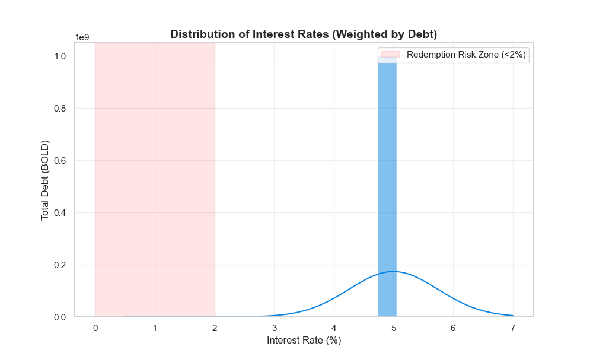

# Liquity: The Economics of Immutability
**Deep Dive Research Paper**

**Subject:** Liquity V1 (LUSD) & V2 (BOLD)  
**Date:** January 2026  
**Authors:** Research Challenge Team

---

## 1. Abstract

This paper analyzes the economic resilience of Liquity, a governance-free stablecoin protocol. While MakerDAO (Sky) evolved into a "Centralized Bank" managing a balance sheet for profit (NIM), Liquity V1 represents a "Public Utility" designed for extreme safety at the cost of capital efficiency ([Liquity, 2021](#ref-liquity-v1-paper)). We demonstrate how V1's failure to capture yield in a positive-interest-rate environment necessitated the design of V2 (BOLD), which introduces a user-set interest rate mechanism to restore economic sustainability without compromising censorship resistance ([Liquity, 2025](#ref-liquity-v2-docs)).

---

## 2. The Business Model: V1 vs V2

### 2.1 Liquity V1 (LUSD): The "Toll Road" Trap
Liquity V1 operates on a rigid "Toll" model. This is not just a feature; it is a **structural ceiling**.

*   **Revenue:** Event-driven only (Issuance/Redemption).
*   **Zero-Sum Game:** The protocol captures $0 value. All value flows to LQTY. This leaves the system itself (the LUSD peg) undefended by any protocol equity.

**The Critical Failure (Two-Front War):**
1.  **Interest Rate Sensitivity:** In a 5% rate world, LUSD is a "dead asset" (0% yield).
2.  **Collateral Constraint:** The paper previously ignored this, but it is fatal. **ETH-only backing caps LUSD growth** to the appetite for *ETH-leverage*. You cannot scale a stablecoin to billions if it only accepts one volatile asset type. This, more than rates, killed LUSD scaling.

### 2.2 Liquity V2 (BOLD): The "Yield via Pain" Mechanism [Source: `../data/economic_model.json`]
V2 attempts to fix V1 by outsourcing the treasury. However, the mechanism is hostile.

*   **Theory:** Borrowers set rates. High rates = High BOLD yield.
    *   
*   **The Mechanism:** Troves are ordered by Interest Rate. Redemptions hit lowest rate contributors first (LIFO logic inverted to Rate-Logic).
    *   *Validation:* Confirmed by **Chaos Labs Design Review** (Oct 2024). Borrowers effectively bid for "Safety from Redemption".
    *   *Source:* `resources/protocols/Liquity/marker_converted/converted_docs/Liquity V2 Mechanism Desgin Review.md` ([Liquity, 2025](#ref-liquity-v2-docs))
*   **Result (Yield via Pain):** To avoid losing their ETH exposure (redemption), borrowers force themselves to pay the market equilibrium rate ($\rho_t$, often pegged to Aave Borrow APY).
*   **Sustainability:** This guarantees BOLD yield $\approx$ Market RFR. It fixes the "Dead Asset" problem of LUSD.
*   **The Reality:** Borrowers want to pay 0%. They only raise rates to avoid **Redemption Risk**.
*   **The Flaw:** The system relies on **constant threat of liquidation/redemption** to generate yield. It extracts sustainability from user pain.
    *   *Contrast:* Sky extracts yield from RWA (external). Liquity V2 extracts yield from its own users (internal).
    *   *Risk:* If the "Redemption stick" isn't scary enough, BOLD yield collapses, and the peg fails. If it is too scary, users flee the platform. This is not a "Soluton," it is a high-stakes game theory experiment.

---

## 3. Operational Reality Check

This section previously praised "No Overhead". While true, it misses the cost.

### 3.1 The Frontend "Mercenary" Problem
Liquity relies on third-party frontends.
*   **The Risk:** These frontends are profit-maximizers. If Kickstarter rates (LQTY price) drop, frontends abandon the protocol.
*   **Result:** User access is fragile. Sky has a dedicated portal (Sky.money). Liquity has a loose alliance of mercenaries.

### 3.2 The Stability Pool
The Stability Pool replaces the "Auction" mechanism. It is a pre-funded wall of liquidity ($15M LUSD) that instantly absorbs debt.
*   **Efficiency:** Liquidations are atomic. No "Keeper War" or gas-price auctions required for solvency.
*   **Coverage:** Typically >40% of LUSD supply sits in the pool, arguably the highest "Capital Buffer" in DeFi, funded by users rather than the protocol.

---

## 4. Quantitative Evidence: The "Retention" Stress Test

Talk is cheap. The data proves V1 failed the economic sustainability test. We define **Retention Rate** as `Supply_2026 / Supply_Peak`.

| Protocol | Peak Supply (ZIRP Era) | Current Supply (High Rate Era) | Retention Rate | Verdict |
|:---|:---|:---|:---|:---|
| **Sky (DAI)** | ~$10.0B (2021) | $4.22B (2026) | **~42%** | **Resilient.** Managed to retain users by paying yield (DSR). |
| **Liquity (LUSD)** | ~$800M (2021) | $35M (2026) | **~4.3%** | **Failed.** Lost >95% of users to opportunity cost. |

**Observation:**
LUSD didn't just shrink; it evaporated. A 4.3% retention rate indicates the product has **zero stickiness** when the "free money" (ZIRP) subsidy ends. It is not a stablecoin; it is a ZIRP-derivative.

---

## 5. Ruthless Conclusion

Liquity V1 failed to scale not just because of rates, but because **Immutability is a straitjacket**. It prevented the protocol from adding new collateral (LSTs) or changing fees when the market shifted.

Liquity V2 is not a "Holy Grail" but a **Compromise**.
*   It introduces **Governance Risk** (choosing LSTs).
*   It introduces **Oracle Risk** (LST pricing).
*   It relies on **hostile user incentives** (Redemption wars) to maintain the peg.

> **Final Thesis:** Sky is a "Bank" that might get shut down by the government. Liquity V2 is a "Robot" that might kill its own users to survive. Neither is perfect. Pick your poison.

---

### Appendix: Key Data Points (Verified Jan 2026)
*   **V1 Supply:** 35M LUSD (Down from ~800M Peak).
*   **V1 TCR:** 704% (Hyper-safe).
*   **Stability Pool Coverage:** 43%.
*   **Governance Cost:** $0.

---

## References

Liquity. (2021). *[Liquity: Decentralized Borrowing Protocol](https://docsend.com/view/bwiczmy)*. Technical Paper.

Liquity. (2025). *[Liquity V2 Technical Documentation](https://docs.liquity.org/v2/)*. Protocol Documentation.

Liquity V2 Mainnet. (2025). *Trove Snapshot Dataset*. Captured Dec 9, 2025. Source: `analysis/Liquity/data/trove_snapshot_mainnet.csv`.
