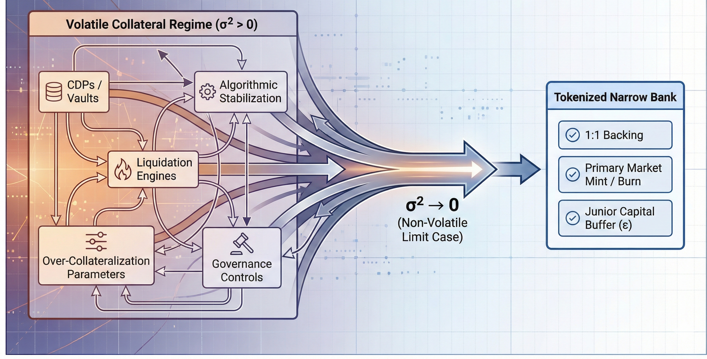
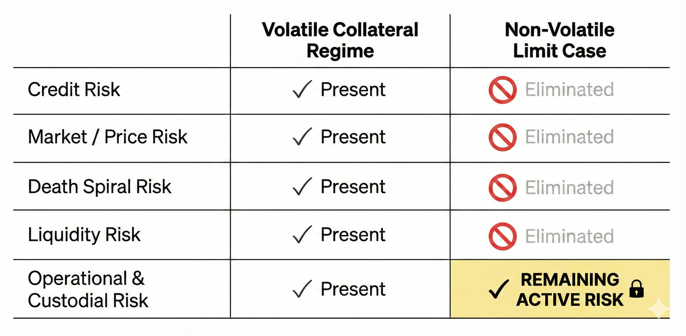

---

# The Non-Volatile Limit Case in Stablecoin Design

## A Boundary Analysis and Degeneracy Result
*Canonical Version — Frozen for Submission*

---

## Abstract

This paper analyzes the theoretical limit case of stablecoin design in which reserve assets are strictly non-volatile relative to the unit of account and legally enforceable for redemption. Under these assumptions, we show that the stablecoin design space collapses to a degenerate structure equivalent to a **primary-market-only tokenized liability (PMOTL)**, a structure economically equivalent to narrow banking but defined here by issuance topology rather than institutional form. In this limit, mechanisms such as over-collateralization, liquidation engines, algorithmic stabilization, and discretionary governance controls become mathematically redundant. The result is not a novel design proposal, but a boundary condition that serves as a reference baseline against which stablecoin systems backed by volatile collateral must be evaluated. Residual risk is shown to be exclusively operational, legal, and custodial in nature, consistent with prior economic treatments of fully backed money-like liabilities ([The Basel Framework, 2019](#ref-basel-framework); [Catalini & de Gortari, 2021](#ref-catalini-degortari)).

---

## 1. Introduction: The Purpose of a Limit Case

Stablecoin design literature frequently focuses on mechanisms intended to mitigate collateral volatility, including liquidation thresholds, feedback controllers, and dynamic monetary policy rules. These mechanisms are often treated as intrinsic features of decentralized currency systems rather than contingent responses to risk ([Catalini & de Gortari, 2021](#ref-catalini-degortari)).

This paper adopts a different approach. Rather than proposing an improved mechanism, it analyzes a **limit case**: a hypothetical regime in which reserve assets exhibit zero price volatility relative to the peg and are legally enforceable for redemption.

The objective is not realism, but **structural clarity**.

> **Thesis:**
> In the limit where reserve asset volatility approaches zero and legal enforceability holds, all stablecoin designs converge to a fully backed, primary-market-only structure equivalent to a **primary-market-only tokenized liability (PMOTL)**.

> *The term “primary-market-only tokenized liability (PMOTL)” is used throughout to emphasize issuance and redemption topology rather than institutional or regulatory form.*

A PMOTL is defined as a system in which stablecoin issuance and redemption occur exclusively against reserve assets at par, with no secondary-market stabilization mechanisms required for solvency.

This result is not a policy recommendation. It is a degeneracy condition that isolates which components of stablecoin design exist to manage volatility rather than to define money-like liabilities themselves, echoing classical narrow-banking arguments ([Gorton & Zhang, 2021](#ref-gorton-zhang)).

**Figure 1: Design Space Collapse in the Non-Volatile Limit**

_Design space collapse under the non-volatile collateral limit. As reserve volatility approaches zero (σ² → 0), stablecoin mechanisms designed to manage price risk become redundant, and system design converges to a fully backed, **primary-market-only tokenized liability (PMOTL)**._

---

## 2. Explicit Assumptions and Scope

This analysis relies on the following assumptions, which are intentionally strong and explicitly bounded:

1.  **Zero Price Volatility**
    Reserve assets have deterministic value relative to the unit of account
    $$\sigma^2 = 0$$

2.  **Legal Enforceability**
    Reserve assets are bankruptcy-remote, senior to issuer liabilities, and legally redeemable for stablecoin holders, consistent with reserve-quality standards discussed in the policy literature ([Catalini & Shah, 2021](#ref-catalini-shah)).
    >*We treat enforceability as deterministic in this boundary regime; relaxing this assumption reintroduces liquidity timing risk and institutional run dynamics beyond the scope of this analysis.*

3.  **High-Quality Liquid Assets (HQLA)**
    Reserves can be liquidated at par at scale without price impact under normal market conditions, as assumed in currency-board and reserve-backed models ([The Basel Framework, 2019](#ref-basel-framework)).

4.  **Atomic Mint/Burn Operations**
    Stablecoin issuance and redemption are fully collateralized and settled atomically.

5.  **Rational Arbitrage**
    Arbitrageurs exist and act on deviations between market price and redemption value.

These assumptions define a **boundary regime**, not an attainable design target. Any relaxation of these assumptions reintroduces complexity and risk, as shown in stochastic models of stablecoin instability ([Klages-Mundt et al., 2022](#ref-klages)).

---

## 3. Risk Taxonomy Under the Non-Volatile Constraint

We classify stablecoin risks and evaluate their status under the stated assumptions.

### 3.1 Eliminated Risks (by Assumption)
**Figure 2: Stablecoin Risk Matrix Across Collateral Regimes**

_Risk classification under volatile and non-volatile collateral regimes. Price-driven solvency risks are eliminated by assumption in the non-volatile limit, while operational and custodial risks remain active constraints_.

1.  **Credit Risk**
    Eliminated *conditional on legal enforceability*.
    If reserve assets default or become legally inaccessible, this assumption fails and the model no longer applies.

2.  **Market / Price Risk**
    Eliminated by definition ($\sigma^2 = 0$).

3.  **Endogenous Reflexive Risk (“Death Spirals”)**
    Eliminated because collateral value is exogenous to protocol success and cannot be diluted or reflexively impaired, unlike algorithmic designs with endogenous backing ([Klages-Mundt et al., 2022](#ref-klages)).

4.  **Price-Driven Liquidity Risk**
    Eliminated insofar as reserve liquidation does not introduce price impact or solvency impairment.

### 3.2 Residual Risks (Irreducible)

1.  **Operational Risk**
    Smart-contract failure, custody errors, fraud, governance bugs.

2.  **Custodial and Legal Risk**
    Asset freezes, jurisdictional seizure, regulatory intervention, as illustrated by real-world reserve-backed proposals such as Libra/Diem ([Libra Association, 2019](#ref-libra)).

3.  **Settlement and Coordination Risk**
    Delays, halts, or legal suspensions in redemption processes.

> **Key distinction:**
> Economic insolvency risk is eliminated.
> Institutional and operational risk is not.

These residual risks are properties of any PMOTL structure and arise independently of market risk or endogenous collateral dynamics.

---

## 4. Formal Limit-Case Result

Let:

*   $S$ = stablecoin supply
*   $A$ = market value of reserve assets
*   $L = S$ = senior liabilities (stablecoins)
*   $\epsilon$ = junior capital buffer (equity)

In standard models, $A(t)$ is stochastic and requires over-collateralization ($\kappa > 1$) such that:
$$A(0) = \kappa \cdot L(0)$$

In the non-volatile limit:
$$\sigma^2 = 0 \Rightarrow A(t) = A(0)$$

Solvency requires:
$$A(t) \ge L(t) + \epsilon(t)$$

Under atomic mint/burn operations:
$$\kappa \to 1$$

**Result:**
Over-collateralization becomes unnecessary. Solvency is preserved through strict issuance discipline rather than price buffers, reproducing the balance-sheet structure of a **primary-market-only tokenized liability**, as observed in narrow banks and currency boards ([The Basel Framework, 2019](#ref-basel-framework)); ([Gorton & Metrick, 2010](#ref-gorton-metrick)).

This is a **degenerate baseline**, not an optimal solution in the general case.Conversely, any stablecoin design that deviates structurally from this baseline must do so because at least one of the limit assumptions—non-volatility, enforceability, or atomic redemption—is violated

---

## 5. Redundancy of Common Stablecoin Mechanisms

### 5.1 Liquidation Engines as Dead Code

Liquidation logic is triggered when collateral value falls below a threshold.

In this regime:
$$V_c(t) = V_c(0) \quad \forall t$$

The trigger condition is unreachable. Liquidation mechanisms become dead code.

---

### 5.2 Algorithmic Stabilization Redundancy

Supply-elasticity mechanisms exist to counteract price deviation driven by collateral volatility or demand shocks.

Here, redemption value is invariant and directly enforceable. Arbitrage restores the peg without protocol intervention, rendering algorithmic stabilization redundant ([Catalini & de Gortari, 2021](#ref-catalini-degortari)).

---

### 5.3 Governance Parameter Redundancy

Governance mechanisms designed to tune risk parameters exist primarily to manage volatility.

Within a PMOTL, discretionary governance introduces risk by violating issuance determinism rather than mitigating economic volatility.

---

## 6. Peg Behavior Under Demand Shocks

Mass redemptions do not induce insolvency or price dislocation, provided reserve liquidity assumptions hold. Peg robustness in this regime follows directly from the PMOTL issuance constraint rather than from market-based stabilization.

However:

* **Economic runs** (price-driven solvency failures) are eliminated.
* **Institutional runs** (legal, operational, or coordination failures) remain possible.

This distinction is critical. The absence of market risk (safe assets) does not imply the absence of systemic risk ([Gorton & Zhang, 2021](#ref-gorton-zhang)). Institutional runs correspond precisely to failures of the legal enforceability, operational continuity, or settlement assumptions; they do not arise from economic insolvency within the modeled regime.

Even in the absence of market risk, legal and operational disruptions can generate redemption pressure that must be absorbed by pre-committed buffers rather than discretionary intervention.

---

## 7. Structural Invariants

In the non-volatile limit, any PMOTL-compliant system must enforce deterministic issuance, unconditional redemption at par, and strict seniority of stablecoin liabilities over any residual claims. The specific enforcement mechanisms and operational failure modes are implementation-dependent and detailed in the Engineering Appendix ([Engineering Appendix, 2026](#ref-eng-appendix)).

---

## 8. Incompatibilities and Exclusions

A PMOTL structure is structurally incompatible with:

* censorship resistance,
* permissionless custody,
* endogenous crypto collateral,
*   monetary sovereignty independent of legal systems.

These are not oversights. They are the cost of eliminating volatility.

---

## 9. Interpretation and Use

This model should be read as:

* a **baseline**, not a recommendation,
* a **reference point**, not an aspiration,
*   a **boundary condition** for evaluating volatile-collateral designs.
*   a diagnostic lens for identifying which stablecoin mechanisms exist solely because issuance deviates from a PMOTL baseline.

Any real-world stablecoin deviates from this structure precisely because its reserves are volatile, endogenous, or legally constrained.

---

## 10. Conclusion

In the non-volatile, legally enforceable limit, stablecoin design collapses to a **primary-market-only tokenized liability**, with narrow banks representing one institutional realization of this structure. Complexity in DeFi stablecoins is not a consequence of decentralization per se, but a defensive response to collateral volatility.

This limit case establishes a clean baseline against which the necessity, cost, and failure modes of volatile-world mechanisms can be rigorously evaluated.

---

## References

* Catalini, C., & de Gortari, A. (2021). *[On the Economic Design of Stablecoins](https://www.nber.org/papers/w29115)*. NBER.
* Catalini, C., & Shah, N. (2021). *[Setting Standards for Stablecoin Reserves](https://www.catalini.com/wp-content/uploads/2021/11/Standards-Reserves-Catalini-Shah-2021.pdf)*.
* The Basel Framework (2019). *[The Basel Framework](https://www.bis.org/basel_framework/standard/LCR.htm?tldate=20260105)*. Bank for International Settlements.
* Gorton, G., & Metrick, A. (2010). *[Regulating the Shadow Banking System](https://papers.ssrn.com/sol3/papers.cfm?abstract_id=1676947)*. Brookings Papers.
* Gorton, G., & Zhang, G. (2021). *[Taming Wildcat Stablecoins](https://papers.ssrn.com/sol3/papers.cfm?abstract_id=3888752)*. SSRN.
* Klages-Mundt, A., et al. (2022). *[While Stability Lasts: A Stochastic Model of Non-Custodial Stablecoins](https://arxiv.org/abs/2004.01304)*. Mathematical Finance.
* Libra Association. (2019). *[The Libra Reserve](https://libra.org/en-US/white-paper/)*.
* Internal. (2026). *[Engineering Appendix: \($\epsilon$) — Loss Absorption & Resolution](../../Design/Design%20with%20Non-volatle%20reserves/Output/epsilon_loss_absorption_appendix.md)*. Project Artifact.

---