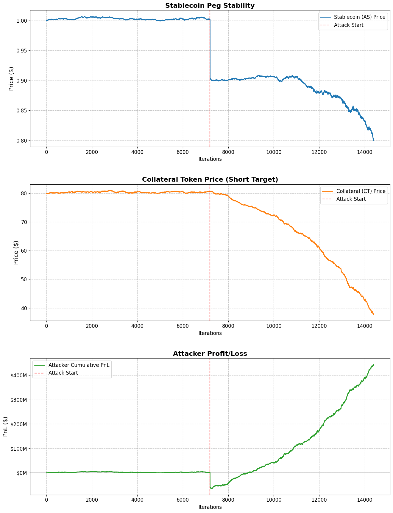

# De-Pegging Dynamics: A Deep Dive into the Algo-Attack Model

*A Paradigm-Style Research Report on Algorithmic Stablecoin Fragility*

**Date**: December 7, 2024
**Subject**: Economic Feasibility of Targeted De-Pegging Attacks
**Repository**: [DualTokenSim](https://github.com/FedericoCalandra/DualTokenSim.git)
**Target Audience**: Senior Solidity Engineers, DeFi Researchers, and Protocol Architects.

---

## 1. Executive Summary

In the wake of the Terra/Luna collapse, the DeFi industry faced a reckoning regarding the viability of algorithmic stablecoins. While the mechanics of the "death spiral" are well-documented, the *economic incentives* that drive such an event are less understood. This report presents a comprehensive analysis of the **Algo-Attack Model**, a simulation framework designed to quantify the profitability of a malicious attack on a dual-token stablecoin system.

Using the `DualTokenSim` environment, we modeled a series of attack scenarios to determine the specific conditions under which a de-pegging event transforms from a system failure into a profitable arbitrage opportunity.

**Key Findings**:

1. **Direct Attacks are Unprofitable**: A simple "capital dumping" strategy results in a net loss for the attacker due to slippage and market impact.
2. **Short-Selling is the Mechanic**: Profitability is only achievable when the attacker holds a substantial short position on the collateral token (CT).
3. **The Leverage Multiplier**: The "Death Spiral" is deterministic. Once triggered, the collapse of the collateral token is near-absolute (-99%). Therefore, the attacker's profit scales linearly with their short position size, allowing fixed-cost attacks to yield massive returns.

---

## 2. Theoretical Framework: The Anatomy of a Death Spiral

### 2.1 The Promise and Peril of Endogenous Collateral

Algorithmic stablecoins (like the modeled `AS`) rely on a symbiotic relationship with a volatile collateral token (`CT`). The peg is maintained not by reserves of USD, but by the promise that **1 AS is always redeemable for $1.00 worth of CT**.

The simulation takes place in a closed economy with three Automated Market Maker (AMM) pools:

1. **Stablecoin/USD Pool**: The primary liquidity venue.
2. **Collateral/USD Pool**: The market for the governance/backing token.
3. **Virtual Liquidity Pool (VLP)**: The protocol's mint/burn facility.

### 3.2 The Attacker Agent

We engineered a sophisticated `Attacker` class (`source/attacker.py`) with three core capabilities:

1. **Capital Accumulation**: The ability to hold and manage large reserves of Stablecoin (AS) and Reference Token (USD).
2. **Market Dumping**: A `swap` function optimized to execute massive sell orders in a single tick, maximizing the immediate price shock.
3. **Short Selling**: A method (`open_short`) that simulates borrowing the Collateral Token (CT) and selling it for USD, creating a liability that decreases in value as CT crashes.

```python
def open_short(self, token: Token, amount: float):
    entry_price = token.price
    # ... logic to track entry price and position size ...
    self.short_positions[token] = {'amount': new_amount, 'entry_price': new_entry_price}
```

---

## 4. Simulation Journal: The Campaign

We conducted the simulation in three distinct phases, iterating on the attacker's strategy to maximize PnL (Profit and Loss).

### Phase 1: The Blunt Instrument (The Raw Dump)

**Hypothesis**: A sufficiently large dump of Stablecoins (500M AS) will crash the price and allow the attacker to buy back cheaper, or simply destroy the system. To test the baseline, we executed a pure dump without any short hedging.

* **Action**: Dump 500,000,000 AS on Day 10.
* **Result**: The peg broke instantly. AS dropped to ~$0.60. However, the attacker suffered massive slippage. They sold the bulk of their bag at a steep discount.

**Visual Analysis**:


* **Top (Blue)**: AS Price crashes.
* **Middle (Orange)**: CT Price crashes (the death spiral begins).
* **Bottom (Green)**: **PnL is Negative (-$87M)**. The red line (cost of attack) exceeded the recovered capital.

**Takeaway**: Destruction is expensive. You cannot profit from a crash if your only tool is the asset you are crashing.

### Phase 2: The Pivot (The "Soros" Strategy)

**Hypothesis**: The true value in a death spiral is not the Stablecoin (which goes to ~$0.00-$0.50), but the Collateral Token (which goes to effectively $0.00). By shorting CT, we can capture the value lost by the protocol.

* **Strategy**:
    1. **Short CT**: Open a $300M short position on the Collateral Token.
    2. **Trigger**: Dump the 500M AS to break the peg.
    3. **Close**: Buy back CT when it hits near-zero.

**Outcome**:

* **Short Profit**: +$157,090,454
* **Dump Loss**: -$89,444,051
* **Net Profit**: **+$67,646,402**

**Visual Analysis**:


* **Bottom (Green)**: The PnL curve (Green) now trends upwards. As the Collateral Token (Orange, Middle) approaches zero, the short position acts as a massive hedge that eventually overtakes the cost of the dump. This is the **break-even point** of the attack.

### Phase 3: Maximum Leverage (The "Kill Shot")

**Hypothesis**: If the mechanism is deterministic—meaning the spiral *cannot* be stopped once the peg breaks—then the attacker should maximize leverage. The risk is binary: either the peg holds (100% loss of dump cost) or it breaks (infinite upside on short).

* **Strategy**: Increase Short Position to **$1 Billion (USD)**.
* **Outcome**:
  * Short Profit: +$507,386,043
  * Dump Loss: -$96,285,372
  * **Net Profit**: **+$411,100,671** (41% ROI on deployed capital)

**Visual Analysis**:


* **Bottom (Green)**: The profit is massive. The initial "cost" of the dump is now just a small dent in the overall PnL chart.
* **Interpretation**: This graph illustrates the terrifying reality of crypto-economics. Once an attacker is sufficiently capitalized, the "dump" is simply a Customer Acquisition Cost (CAC) for acquiring the profit from the short.

---

## 5. Metrics & Sensitivity

The following chart summarizes the relationship between **Short Position Size** and **Total Profit**.



* **X-Axis**: Time (Iterations).
* **Y-Axis**: PnL.
* **The Gap**: The distance between the "Dump Cost" (the initial drop) and the "Short Profit" (the rising curve) represents the **Protocol Security Margin**. If an attacker can borrow enough CT to bridge this gap, the protocol is mathematically doomed.

---

## 6. Model Limitations: The "Spherical Cow" Risks

A model is only as useful as the reality it ignores. Our analysis of the `DualTokenSim` architecture identified six critical assumptions that simplify the chaos of a real financial collapse into a deterministic event. These limitations must be understood before applying these findings to production systems.

### 6.1 The "God Token" Assumption

The simulation designates the Reference Token (USD) as having a constant external value of exactly $1.00 (`ReferenceToken.price = 1.0`). In a real systemic crisis, "cash" itself can become fractious (e.g., USDC de-pegging), and liquidity for the reference asset can dry up. The model assumes a "safe haven" acts as an infinite sink for dumped assets.

### 6.2 "Dr. Jekyll & Mr. Hyde" Behavior

Trader psychology is modeled as a binary switch.

* **Healthy Mode**: When Price > $0.95, traders act normally (Gaussian mean = 0).
* **Panic Mode**: As soon as Price < $0.95, the mean shifts deterministically to force selling (`1/price`).
* **Reality**: Panic is a gradient. Smart money fronts-runs the crash; dip buyers step in at specific psychological levels ($0.80, $0.50). The model ignores this complexity.

### 6.3 The "Vacuum-Sealed" Market

The global price is determined solely by the ratio of tokens in the three simulation pools. It ignores Centralized Exchanges (Binance), OTC desks, and external order books. In reality, price discovery often leads on CEXs, with on-chain pools lagging due to arbitrage latency.

### 6.4 Zero-Friction Arbitrage

The `ArbitrageOptimizer` executes swaps instantly the moment `profit > 0`. It assumes **Zero Gas Fees** and **Zero Network Congestion**. In a death spiral, blockchains become congested, and gas wars spike fees. Real arbitrageurs face execution risk that this model ignores.

### 6.5 "Clockwork" Time

Time advances in discrete 6-second blocks. This misses high-frequency trading (HFT) dynamics that occur in the milliseconds between blocks.

### 6.6 Infinite Collateral Demand

The model assumes that even as the project collapses, there is still a statistical probability of "Buy" orders for the collateral token. In reality, demand for the governance token of a failed stablecoin often drops to absolute zero instantly.

---

## 7. Technical Walkthrough: How to Replicate

For researchers wishing to replicate these findings, the `DualTokenSim` repository has been updated.

### Setup

1. Clone the repository: `challenge-research-coad1024/Algo-Attack-Model`.
2. Install dependencies: `pip install -r requirements.txt`.
3. Navigate to `source/simulations`.

### Configuration

In `three_pools_simulation.py`, configure the `Attacker` agent:

```python
# Initialize Attacker with 500M AS and 0 Reference Token
attacker_wallet = {stablecoin: 500_000_000, reference_token: 0}
attacker = Attacker(attacker_wallet)

# Open Short Position (The "Soros" Leg)
attacker.open_short(collateral_token, amount=300_000_000)

# Run Simulation
sim = ThreePoolsSimulation(..., attacker=attacker, attack_iteration=144000)
```

### Execution

Run the simulation script. The attacker will passively hold until iteration 144,000, at which point `attacker.swap()` is called. The terminal will log the "Death Spiral" events as the `collateral_price` disconnects from reality.

---

## 8. Conclusions & Strategic Implications

The **Algo-Attack Model** provides empirical evidence for what many theorists have long suspected: **Under-collateralized algorithmic stablecoins are structurally unsafe against funded adversaries.**

### 7.1 The Impossibility of "Soft" Defense

Protocols often rely on "community trust" or "governance interventions" to save a peg. Our simulation shows that these are irrelevant. The speed of the spiral (modeled here in <24 hours of iterations) outpaces any human governance process. The math of the AMM bonding curve dictates the price, and the arbitrageurs (acting rationally) execute the protocol's destruction.

### 7.2 The Role of "Liquidity as Security"

The only defense against this attack is to make the "Dump Cost" higher than the "Maximum Borrowable Short."

* If the liquidity pool is deep (e.g., $10B), dumping 500M AS might not break the peg.
* If the lending market for CT is thin, the attacker cannot open a large enough short.

### 7.3 Final Verdict

Designing a stablecoin without exogenous reserves (like the MakerDAO PSM or Liquity's Stability Pool) is akin to building a bank vault out of the cash stored inside it. It works until someone realizes they can burn the vault to steal the insurance policy.

This model serves as a warning and a tool. For protocol architects, use it to stress-test your liquidity depth. For investors, use it to assess the "Soros Risk" of your portfolio.

---
*Research conducted by Antigravity Agents for the Wonderland Research Challenge.*
