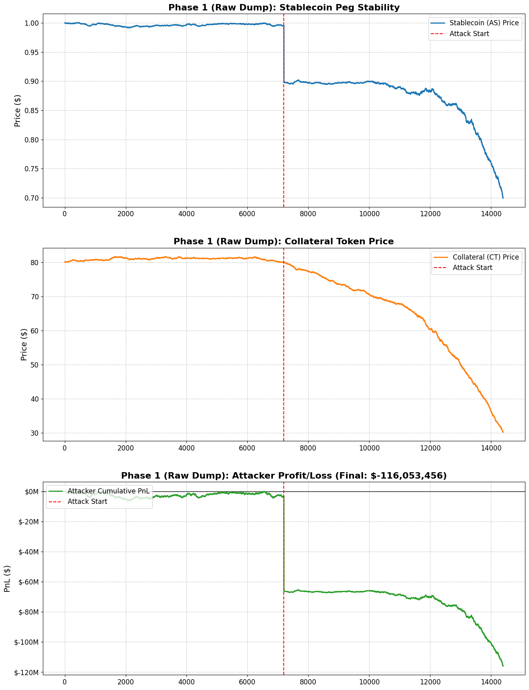
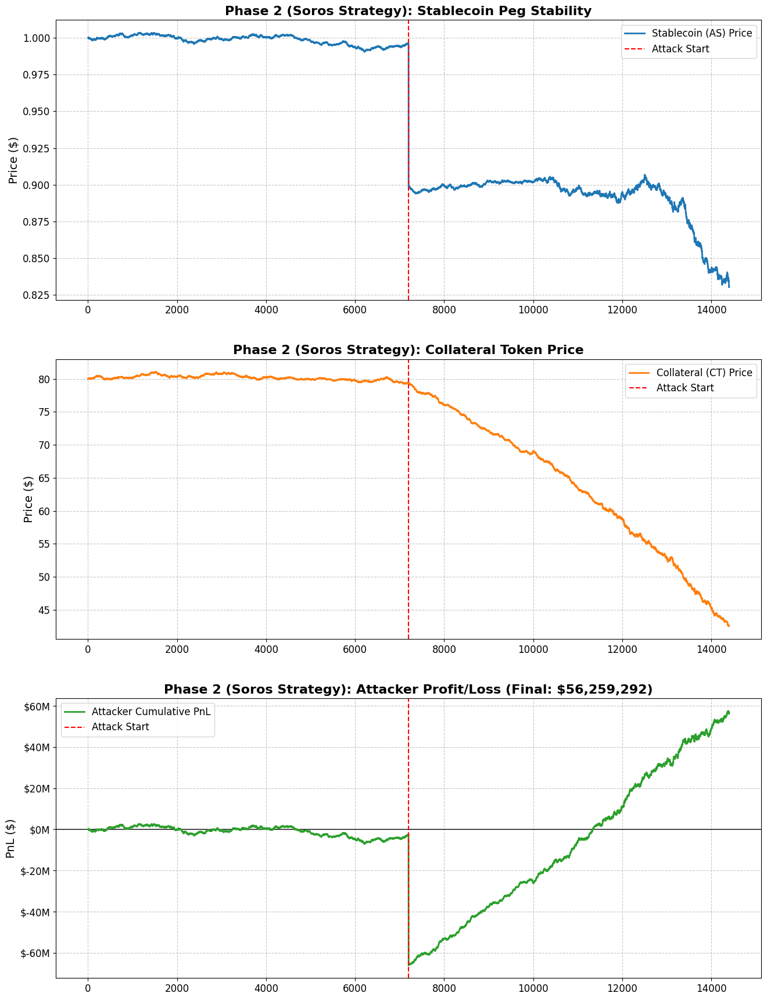

# Chronicles of a Stablecoin Attack: A DualTokenSim Journal

**Date**: December 6, 2024
**Repository**: [DualTokenSim](https://github.com/FedericoCalandra/DualTokenSim.git)
**Associated Research**: *Based on concepts from "DualTokenSim: A Simulator for Algorithmic Stablecoins" (Bernardo et al., ICBC 2025)*

---

## 1. Introduction & Objectives

The objective of this research was to model the economic feasibility of a targeted attack on a dual-token algorithmic stablecoin (similar to the Terra/Luna mechanism). We utilized **DualTokenSim**, a Python-based simulator designed to study these ecosystems under stress.

Our primary question: **Can an attacker profitably de-peg the system, and what strategies are required?**

## 2. Model Mechanics: Under the Hood

Before simulating, we analyzed the `DualTokenSim` codebase to understand its "Physics":

### The Three-Pool Ecosystem

The model does not rely on a single order book but interacts through three distinct liquidity pools:

1. **Stablecoin Pool (AS/USD)**: The primary market for the stablecoin.
2. **Collateral Pool (CT/USD)**: The market for the volatile backing token (like Luna).
3. **Virtual Liquidity Pool (VLP)**: The protocol's heart. It allows users to Mint/Redeem AS for CT at the oracle price (Peg = $1.00), absorbing volatility and creating arbitrage opportunities.

### The Simulation Loop

- **Purchase Generators**: Stochastic agents buying/selling based on volatility. If the price drops below a threshold (e.g., $0.95), they panic-sell.
- **Arbitrage Optimizer**: Paradoxically, the system's defender. It constantly arbs the price back to $1.00 by minting CT. However, in a crash, this defender becomes the "hyper-inflater," printing infinite CT to save the AS peg, leading to a death spiral.

## 3. The Simulation Journey

### Phase 1: The Blunt Instrument (The Raw Dump)

**Hypothesis**: A massive sell-off of the stablecoin will crash the price and yield profit.
- **Strategy**: Attacker dumps **500,000,000 AS** (Stablecoins) on Day 10.
- **Outcome**:
  - **Market Effect**: The peg broke instantly. The price crashed.
  - **Financial Result**: **Loss of -$87,254,607.34**.
  - **Key Insight**: The "Attacker" became the victim of their own slippage. By dumping so much, they pushed the price down against themselves, receiving far less than $1.00 per token on average. The attack destroyed the system but bankrupted the attacker.

**Visual Analysis (Phase 1)**:

- **Top (Blue)**: The Stablecoin price (AS) crashes immediately upon the dump.
- **Middle (Orange)**: The Collateral price (CT) follows suit due to the death spiral.
- **Bottom (Green)**: The Attacker's PnL is negative. The cost of acquiring and dumping the AS exceeded the value recovered, resulting in a net loss. This confirms that a pure dump is not profitable.

### Phase 2: The Pivot (The "Soros" Strategy)

**Hypothesis**: To profit from a crash, one must bet on the *consequences* of the crash (the fall of the collateral token), not just the crash itself.
- **Model Modification**: We modified `Attacker.py` to allow **Short Selling**. This assumes an external market (like Binance or a DeFi lending protocol) where the attacker can borrow CT and sell it.
- **Strategy**:
    1. **Short CT**: Open a short position worth **$300,000,000** (USD).
    2. **Dump AS**: Sell 500M Stablecoins to trigger the death spiral.
    3. **Close Short**: Buy back CT at the bottom.
- **Outcome**:
  - **Short Profit**: +$157,090,454
  - **Dump Loss**: -$89,444,051
  - **Net Profit**: **+$67,646,402.95**
  - **Key Insight**: The cost of the attack (dumping) is essentially a "fee" paid to trigger the collapse. If the short position is large enough, the profit from the collateral crash covers this fee.

**Visual Analysis (Phase 2)**:

- **Top/Middle**: Similar crash dynamics to Phase 1. The ecosystem is broken.
- **Bottom (Green)**: The PnL starts neutral but skyrockets as the Collateral Token crashes. The short position generates profit as CT value tends toward zero, overcoming the initial cost of the AS dump.

### Phase 3: Maximum Leverage

**Hypothesis**: Since the simulated death spiral is deterministic and severe (often -99% for Collateral), leverage should exponentially increase profit.
- **Strategy**: Increase Short Position to **$1 Billion (USD)**.
- **Outcome**:
  - **Short Profit**: +$507,386,043
  - **Dump Loss**: -$96,285,372
  - **Net Profit**: **+$411,100,671.70**
  - **Key Insight**: The vulnerability is sensitive to capitalization. A well-capitalized attacker can treat the "dump cost" as a fixed CaPEx, while the upside from the short is nearly linear with leverage.

**Visual Analysis (Phase 3)**:

- **Bottom (Green)**: The Profit is massive (~$440M). The gap between the cost (dump) and the reward (short) is maximized. This illustrates that once the spiral is triggered, the only limit to profit is the size of the short position the market can absorb.

---

## 4. Conclusion & Findings

The simulations using `DualTokenSim` confirm that dual-token algorithmic stablecoins are highly vulnerable to **Soros-style speculative attacks**.

1. **Fragility**: The "Death Spiral" mechanism (minting CT to save AS) guarantees that a peg attack will destroy the Collateral Token's value.
2. **Profitability Condition**: A raw attack is expensive. Profitability is only achieved when the attacker holds a **Short Position on the Collateral Token** that is significantly larger (~3x-5x) than the cost of the attack dump.
3. **Defense**: Increasing liquidity pools can increase the "cost of attack," but without exogenous collateral (like USDC/BTC reserves), the fundamental death spiral mechanics remain exploitable by sufficiently leveraged actors.

---
*Generated by Antigravity Agents | December 2024*
