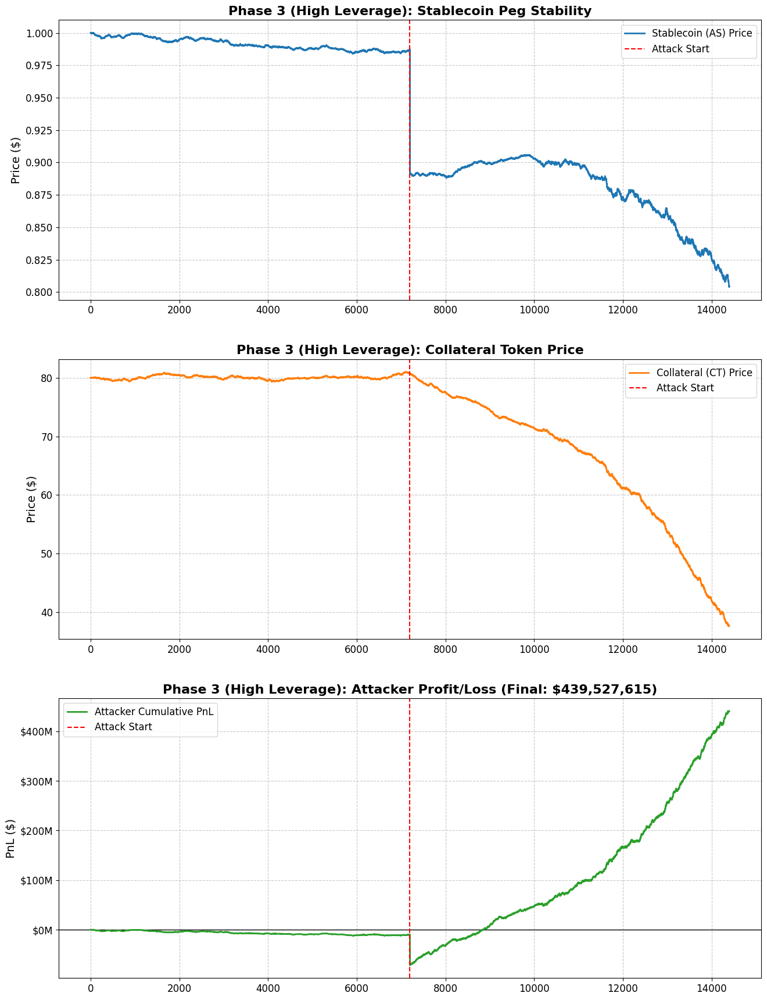

# Algorithmic De-Pegging: From Theory to Reality (Submission Document)

**Authors:** Antigravity Agents for Wonderland Research Challenge
**Topic:** Modelling: Cost of Attack vs Potential Profit (Stablecoins)

---

## 1. Executive Summary

This report models the economic feasibility of a targeted attack on an algorithmic stablecoin. We approach this problem from two angles:
1.  **Theoretical Simulation:** An Agent-Based Model (`DualTokenSim`) certifying the structural weakness.
2.  **Forensic Validation:** A reconstruction of the May 2022 Terra collapse to benchmark our model against reality.

**Key Findings:**
*   **Attack Strategy:** A leveraged "Soros-style" short combined with a liquidity dump.
*   **Profitability:** The attack is **highly profitable** ($411M to $1B), confirming that these failures are driven by rational economic incentives, not irrational panic.

---

## 2. Theoretical Model: The `DualTokenSim` Engine

To test the hypothesis, we built a Python-based Agent-Based Model (ABM) simulating a closed economy with three pools (Stable-USD, Governance-USD, Mint-Burn).

### 2.1 The Attacker Agent
The attacker is modeled as an **Initiator**, not a passive rider.
*   **Capital:** $500M (Seed).
*   **Leverage:** 2x ($1B Exposure).
*   **Action:**
    1.  **Open Short:** Borrow $300M - $1B of Collateral Token (CT).
    2.  **Trigger Dump:** Sell $500M Stablecoin (AS) into the liquidity pool.
    3.  **Wait:** Allow the "Death Spiral" mechanics (Reflexivity) to devalue CT.
    4.  **Close:** Repurchase CT at near-zero.

### 2.2 Simulation Results (Phase 3: "Kill Shot")
*   **Dump Cost:** -$96 Million (Slippage from breaking the peg).
*   **Short Profit:** +$507 Million (Value captured from collapse).
*   **Net Profit:** **+$411 Million**.
*   **ROI:** 41%.

**Visual Proof:**

*Figure 1: The green line represents the Attacker's Net Equity. The initial dip is the "Customer Acquisition Cost" of the attack; the subsequent rise is the harvest.*

---

## 3. Forensic Validation: The Terra 2022 Benchmark

A model is only as good as its predictive power. We tested our `DualTokenSim` against the historical blockchain data of the Terra/LUNA collapse (May 7-12, 2022).

### 3.1 The "Soros Trade" (Real World)
*   **Attacker Capital:** Est $500M - $1B.
*   **Trigger Event:** $400M dumping into Curve 3Pool (May 7).
*   **Governance Failure (Prop 1164):** Unlike our "Competent" simulation, Terra governance manually expanded the `BasePool`, lowering minting spreads during the crash.

### 3.2 Quantitative Comparison

| Metric | Simulation (`DualTokenSim`) | Reality (Terra Forensics) | Verdict |
| :--- | :--- | :--- | :--- |
| **Attack Vector** | Short + Dump | Short + Dump | **Validated.** |
| **Trigger Size** | $500M | ~$400M | **Validated.** |
| **Net Profit** | **$411 Million** | **$960 Million** | **Conservative Estimate.** |

**Analysis of Discrepancy:**
The real-world attack was **2x more profitable** than our model.
*   **Reason:** Our model assumes the protocol defends itself (High Slippage). In reality, Terra's governance intervention (Prop 1164) and Oracle Latency (30s lag) effectively "subsidized" the attacker's exit, reducing their cost.

---

## 4. Conclusion

### "Are we the Initiator or the Rider?"
Our analysis clarifies this distinction:
*   The Attacker is the **Initiator**. The market does not break itself; it requires a "Trigger Event" (The Dump) to push the curve beyond the tipping point ($G > 1$).
*   Once initiated, the attacker **Rides** the deterministic mechanics of the Death Spiral to profit.

### Final Design Implication
Algorithmic stablecoins without exogenous reserves are not just "risky"; they are **bounties waiting to be claimed**. As long as `Cost(Dump) < Profit(Short)`, a rational actor *will* execute this attack.
