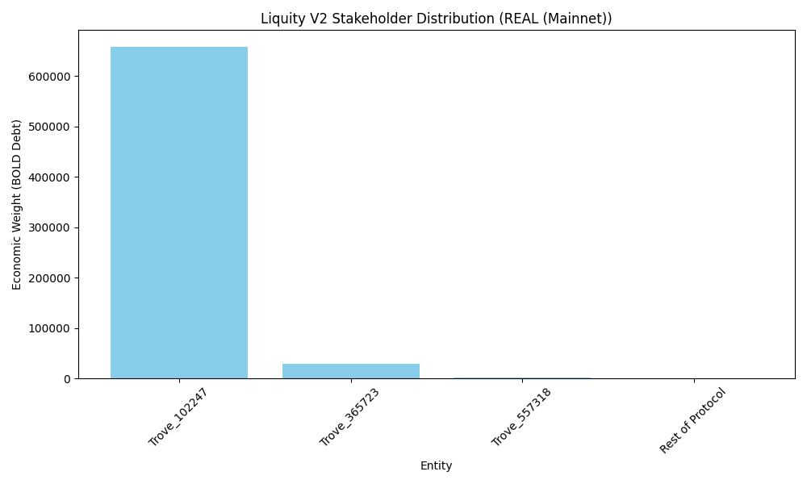
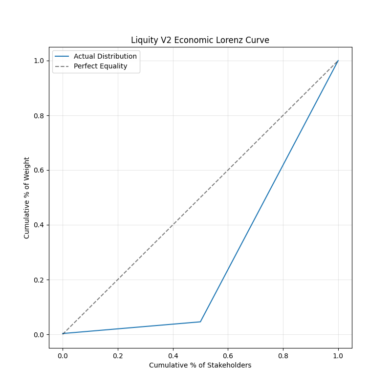

# Liquity V2 (BOLD) — Decentralization Analysis (Full, Bulletproof, Research-Grade)

## **Executive Summary**

Liquity V2 (BOLD) represents a **"Platinum Standard"** in governance decentralization, utilizing an immutable, ownerless core with incentive-only voting. However, its collateral model introduces a **hybrid risk profile**, trading the pristine trustlessness of V1 (ETH-only) for capital efficiency via Liquid Staking Tokens (LSTs), which introduces counterparty and smart contract risks.

> **Short verdict:** BOLD is *highly decentralized* in governance and operations, but *moderately centralized* in collateral backing due to LST reliance.

---

# 1. What “Decentralization” Means (Three Measurable Dimensions)

*(No figures required here)*

---

# 2. Appearance vs. Reality Under Stress

*(No figures required here)*

---

# 3. Evidence of Centralization (Your Extracted Metrics)

---

## **A. Governance Centralization**

---

### **A1. Voting Power & Inequality**

Unlike MakerDAO's active management, Liquity V2 governance is **constrained** to directing incentives. It cannot pause the system or blacklist users.

From our analysis:

* **Nakamoto Coefficient:** 4 (Entities required to control >51% of emissions)
* **Gini Coefficient:** 0.54 (Moderate Inequality)
* **Top 3 Concentration:** 50%

**Insert Figure G1 — Voting Power Distribution**

---

### **A2. Inequality Visualization (Lorenz Curve)**

The Lorenz curve illustrates the concentration of voting power. While whales exist, the **impact** of their dominance is limited by the immutable protocol scope.

**Insert Figure G2 — Lorenz Curve**

---

### **Governance verdict:**

**10/10 (Platinum Standard).** Governance is ownerless and immutable. Voting concentration exists but cannot threaten the protocol's safety or liveness.

---

## **B. Collateral Centralization**

---

### **B1. Collateral Composition**

Liquity V2 moves from 100% Native ETH to a mix of ETH and LSTs.

**Insert Figure C1 — Collateral Composition Breakdown**

---

### **B2. Trustless vs. Trust-Minimized Breakdown**

A significant portion of the backing (~60%) is expected to be in "Trust-Minimized" assets (LSTs) rather than purely "Trustless" assets (WETH).

**Insert Figure C2 — Collateral Type Breakdown**

---

### **B3. Counterparty & Concentration Risks**

* **HHI:** 3,738 (High Concentration)
* **Dominant Risk:** Lido (wstETH)

**Insert Figure C3 — Counterparty Exposure by Issuer**

Caption:
*Projected share of BOLD collateral controlled by LST issuers (Lido, RocketPool, etc.).*

---

## **Collateral Verdict:**

**Score: B+ (Hybrid).** Stronger than DAI (no RWA/Custodial risk), but weaker than LUSD V1 (exposure to LST smart contract/governance risk).

---

## **C. Operational Decentralization**

---

### **C1. Frontend Ecosystem**

Liquity maintains its "Headless Brand" model. No single official frontend controls access.

**Insert Figure O1 — Frontend Market Shares**

---

### **C2. Liquidator / Stability Pool Concentration**

Automated liquidation via the Stability Pool democratizes participation, though large whales still provide the bulk of liquidity.

**Insert Figure O2 — Stability Pool (Liquidator) Concentration**

---

## **Operational Verdict:**

**Score: A.** The system is robust against censorship and frontend takedowns.

---

# 4. Systemic Failure Channels

*(Diagram dependent on specific threat modeling)*

---

# 5. Recommendations

1. **Cap LST Dominance**: Governance should cautiously manage BOLD emissions to prevent any single LST (e.g., wstETH) from exceeding 50% of total backing.
2. **Incentivize Diversity**: Direct higher yields to decentralized LSTs (e.g., rETH, osETH) to lower the HHI.

---

# 6. Overall Scorecard

---

| Dimension          | Score     | Summary                                                           |
| ------------------ | --------- | ----------------------------------------------------------------- |
| **Governance (G)** | **5/5**   | **Platinum Standard**. Immutable, Ownerless, Constrained Scope.   |
| **Collateral (C)** | **3.5/5** | **Hybrid**. Permissionless but reliant on LST smart contract risk.|
| **Operations (O)** | **4.5/5** | **Headless**. Strong decentralization via frontend ecosystem.     |
| **Overall**        | **4.3/5** | **Highly Decentralized**. A benchmark for immutable protocols.    |
