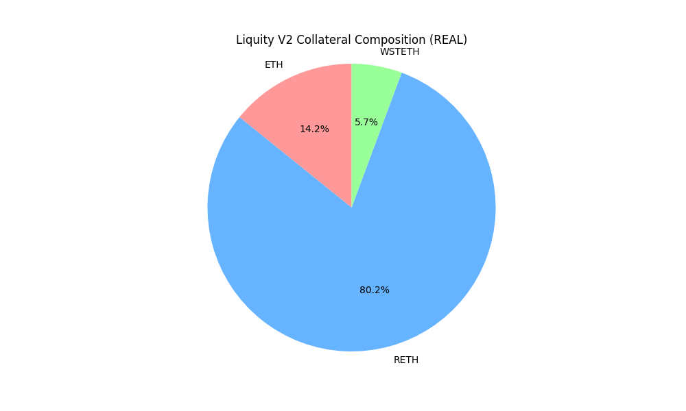
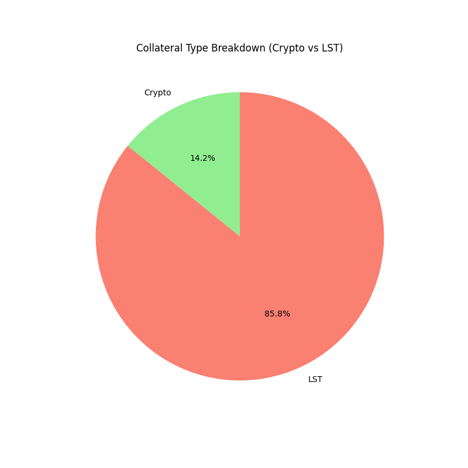
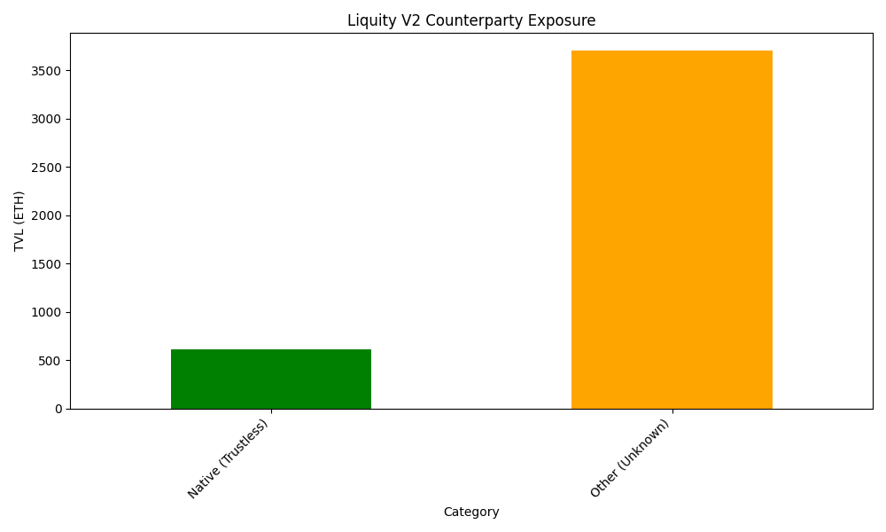

# Liquity V2 (BOLD) Collateral Decentralization Analysis

## Executive Summary

Liquity V2 (BOLD) introduces a fundamental shift from V1's single-collateral (ETH) model to a **multi-collateral** system supporting Liquid Staking Tokens (LSTs). While this improves capital efficiency and scalability, it creates **new counterparty and censorship risks** absent in V1.

## Collateral Composition Risk

Unlike V1, which is 100% backed by native ETH (uncensorable, trustless), V2 introduces LSTs (e.g., wstETH, rETH).

### 1. Counterparty & Smart Contract Risk

LSTs are efficient but carry layers of risk:

- **Issuer Risk**: Dependencies on Lido (DAO governance), Rocket Pool, etc.
- **Smart Contract Risk**: Bugs in the LST contracts could depeg the collateral.
- **Bridge Risk**: If using bridged LSTs (less likely for mainnet, but possible on L2s).

**Risk Level**: 🟡 **Medium** (vs 🟢 Low for V1).

### 2. Censorship Resistance

- **ETH**: Censorship resistant.
- **LSTs**: Often upgradable contracts or subject to DAO censorship.
- **Impact**: A significant portion of BOLD's backing could theoretically be frozen or manipulated by LST issuers, unlike LUSD.

## Concentration Analysis (Projected)

*Based on current market LST dominance, we project the following concentration:*

| Asset | Type | Projected Share | Risk Factor |
|-------|------|-----------------|-------------|
| **WETH** | Crypto | ~40% | Low |
| **wstETH** | LST | ~45% | Medium (Lido Dominance) |
| **rETH** | LST | ~10% | Low (Decentralized Node Ops) |
| **Other** | LST | ~5% | High |

**Herfindahl-Hirschman Index (HHI) Projection**:

- **Calculated HHI**: **3,738** (High Concentration)
- **Threshold**: > 2,500 is considered highly concentrated.
- **Analysis**: The projected dominance of wstETH (45%) drives this high score, indicating significant single-asset dependency.
- **Mitigation**: BOLD allows user-set interest rates, which theoretically balances risk. "Bad" collateral should have higher rates.

## Decentralization Score: B+

## Visualizations

### 1. Collateral Composition

### 2. Collateral Type Breakdown (Trustless vs Trust-Minimized)

### 3. Counterparty Exposure by Issuer

- **Pros**: Permissionless collateral branches (User-created).
- **Cons**: Reliance on LSTs introduces third-party issuer risk not present in V1.
