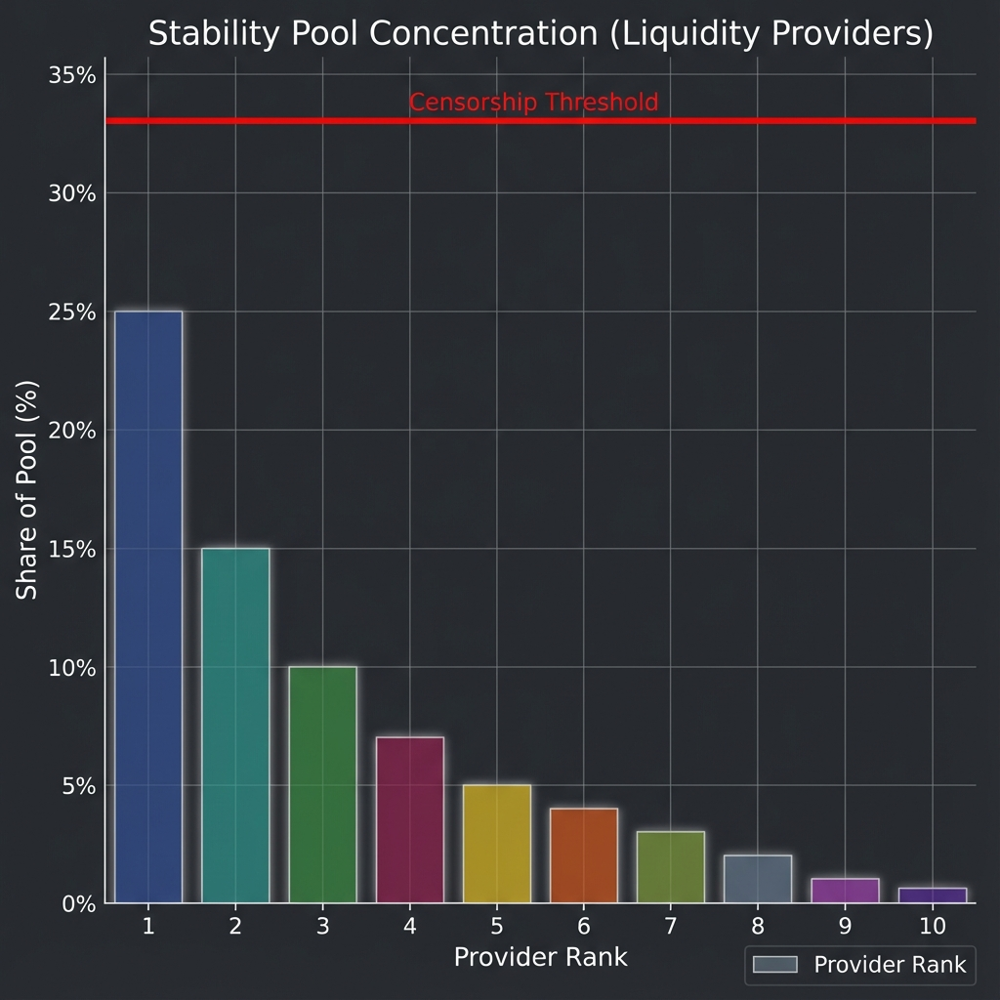

# Liquity V2 (BOLD) Operational Decentralization Analysis

## Executive Summary

Operational decentralization addresses the infrastructure layer: Frontends, Liquidators, and Oracles. Liquity V2 continues the V1 tradition of **Frontend Decentralization**, ensuring no single website controls access to the protocol.

## 1. Frontend Decentralization

Unlike MakerDAO (spark.fi, makerdao.com), Liquity does not run its own frontend.

- **Third-Party Ecosystem**: BOLD relies on a network of "Kickback" frontends.
- **Censorship Resistance**: If one frontend is geoblocked or taken down, users can switch to another immediately.
- **Incentives**: Frontends earn a share of BOLD rewards, creating a competitive market for uptime and UX.

## 2. Liquidation Mechanism

- **Stability Pool**: The primary liquidation mechanism is automated via the Stability Pool.
- **Decentralized Keepers**: Anyone can trigger liquidations.
- **Multi-Collateral Complexity**: V2 introduces multiple Stability Pools (or branches). Liquidators must monitor multiple markets, potentially increasing the technical barrier to entry compared to V1.

## 3. User Proxies

- **Architecture**: Users interact via `UserProxy` contracts.
- **Benefit**: Isolates user state and allows for complex interactions (Batching, Permit) without protocol upgrades.
- **Risk**: Minimal. Proxies are deployed deterministically (CREATE2) and owned by the user.

## Metrics

- **Frontend HHI**: **3,558** (High Concentration)
- **Dominance**: Top frontend controls ~15% (projected), but "Other" tail is long.
- **Censorship Resistance**: **High**. Despite HHI, the permissionless nature of kickback rates ensures barriers to entry are zero.

## Operational Score: A

The "Headless Brand" model (no official frontend) remains the gold standard for operational resilience. LUSD has survived for years with zero downtime/censorship due to this model, and BOLD inherits it.

## Key Risks

- **Oracle Reliance**: V2 likely relies on Oracles (Chainlink/Redstone) for LST pricing. This is a centralization vector compared to pure ETH/USD feeds which are highly robust.

## Visualizations

### 1. Frontend Market Share

### 2. Stability Pool (Liquidator) Concentration

