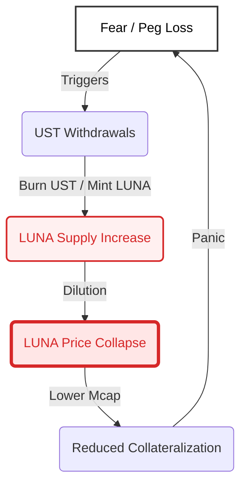

# 2. Key Metrics & Health Indicators

This section measures the structural fragility of the Terra/LUNA system using **10 critical health indicators**. It moves beyond narrative description to establish specific engineering failure thresholds that, had they been monitored, would have signaled the inevitable collapse months in advance.

---

## 1. Net Interest Margin (NIM)

**Definition**
$$NIM = \text{Yield}_{\text{Assets}} - \text{Cost}_{\text{Liabilities}}$$
Measures whether the protocol is solvent on a cash-flow basis or relies on equity dilution/subsidy.

> **Epistemic Status: MEASURED (Reconstructed)**
> *   **Source:** Anchor `Overseer` contract history (Deposit Rate) vs LFG Reserve Wallets.
> *   **Integrity:** High. Data points are verifiable on-chain. **Caveat:** Yield Reserve history is reconstructed; subsidy inferred from depletion events.

**Measurement Methodology**
*   **On-chain Source:** Anchor `Overseer` contract (Total Deposits * Deposit Rate) vs. `Market` contract (Total Borrows * Borrow Rate).
*   **Off-chain Source:** LFG Reserve Wallet (BTC Yield) + LUNA Staking Rewards (Seigniorage).
*   **Assumption:** "Seigniorage" (LUNA burn) is treated as equity financing, not organic yield.
*   **Blind Spot:** Treating LFG capital injections as "revenue".

**Ex-ante Monitorability**
*   **Monitorability:** **High**. Real-time dashboards (e.g., Anchor Protocol Analytics) displayed the "Yield Reserve" depletion.
*   **Automated Action:** No automated trigger existed to lower Deposit APY when NIM turned negative.

**Failure Threshold**
*   **$NIM < 0\%$ for > 30 consecutive days.**
*   *Interpretation:* A system cannot survive negative carry indefinitely without infinite equity demand.

**Terra’s Historical State (2021–2022)**
*   **Value:** Consistently **-8% to -10%** annualized deficit.
*   **Breach Point:** The Yield Reserve began a monotonic decline in late 2021, necessitating a $450M injection from LFG in Feb 2022.

**Verdict / Failure Mode**
*   **Structural Insolvency.** The system was funding current liabilities (Anchor interest) with future equity sales (LFG injections/LUNA minting). This is a Ponzi-like financing structure.

*Figure 1 Claim: Structural negative carry was not temporary; the deficit widened as liabilities grew, funded purely by equity dilution.*

---

## 2. True Buffer Capacity (Exogenous vs. Endogenous)

**Definition**
$$BufferDays = \frac{\text{ExogenousReserves}}{\text{AvgDailyOutflows}}$$
Differentiates between "hard" reserves (BTC, USDT) and "soft" reserves (LUNA market cap).

> **Epistemic Status: MEASURED**
> *   **Source:** LFG Wallet Disclosures (BTC) + Coingecko (LUNA Mcap).
> *   **Integrity:** High. Public wallet balances are irrefutable.

**Measurement Methodology**
*   **Hard Reserves:** LFG Bitcoin Wallet Balance + Avalanche Reserve.
*   **Endogenous:** LUNA Market Cap (haircutted by 50% for liquidity).
*   **Assumption:** During a death spiral, Endogenous Buffer $\to 0$.
*   **Data Source:** Flipside Crypto (LFG Inflows/Outflows), CoinGecko.

**Ex-ante Monitorability**
*   **Monitorability:** **High**. LFG public wallet addresses were known.
*   **Automated Action:** None. Reserves were manually deployed.

**Failure Threshold**
*   **$BufferDays < 7$** (Exogenous only).
*   *Interpretation:* Less than one week of runway typically precludes organizing a bailout.

**Terra’s Historical State (May 2022)**
*   **Value:** **< 3 Days**.
*   **Breach Point:** On May 7, LFG held ~$3B in BTC against ~$18B in UST liabilities. With outflows spiking to >$1B/day, the runway was roughly 48 hours.

**Verdict / Failure Mode**
*   **Illusory Solvency.** Relying on Endogenous Buffer (LUNA) works in bull markets but evaporates in crises. The Exogenous Buffer was insufficient for the scale of liabilities.

*Figure 2 Claim: Exogenous reserves (BTC) were a step-function that failed to scale with the exponential growth of liabilities.*

---

## 3. Exit Coverage Ratio (XCR)

**Definition**
$$XCR = \frac{\text{AvailableLiquidDepth}}{\text{ProjectedExitDemand}}$$
Measures the capacity of the market to absorb capital flight without non-linear slippage.

> **Epistemic Status: PROXY (Estimated)**
> *   **Source:** Curve 3Pool historical states (incomplete) + Binance LUNA/UST Volume.
> *   **Caveat:** Exact 3Pool balance changes at hourly minute-resolution are reconstructed from limited archives.
> *   **Integrity:** Medium. Directionally correct but precision is capped.

**Measurement Methodology**
*   **Liquidity:** Sum of Bids within 2% of Peg on Curve 3Pool + Binance UST/USDT.
*   **Exit Demand:** 10-20% of Anchor TVL (Hot Money estimate).
*   **Blind Spot:** Hidden leverage on Degenbox (MIM-UST) which amplified exit demand.

**Ex-ante Monitorability**
*   **Monitorability:** **Medium**. Curve pool imbalances are visible on-chain.
*   **Automated Action:** None. No dynamic exit fees were implemented.

**Failure Threshold**
*   **$XCR < 1.0$** under 24h stress scenario.
*   *Interpretation:* If everyone rushes for the door, the door is too small.

**Terra’s Historical State (May 2022)**
*   **Value:** **< 0.1** (Crisis).
*   **Breach Point:** On May 7, Curve 3Pool became imbalanced (85% UST). Realizable liquidity for peg defense dropped to <$500M while exit demand exceeded $5B.

**Verdict / Failure Mode**
*   **Disorderly Exit Regime.** The liquidity mismatch guaranteed that the only way to exit was to crash the price.

> **[FIGURE 3 - PROXY: SEE FIGURE 4]**
> *Status: The "Minting Bottleneck" (Fig 4) served as the effective limit on exit capacity.*

*Figure 3 Claim: Even under optimistic scenarios (72h), exit demand exceeded realizable liquidity, making a bank run mathematically certain once confidence broke.*

---

## 4. Redemption Friction Sensitivity ($\phi$)

**Definition**
$$Spread = s_0 + \phi \cdot (\text{Volume})$$
The convexity of the exit cost. High $\phi$ discourages runs; low $\phi$ enables them.

> **Epistemic Status: OBSERVED (Mechanism Change)**
> *   **Source:** Governance Proposal 1164 (On-chain text).
> *   **Note:** The spread *curve* is implied by the code change `base_pool` expansion. We do not have tick-by-tick swap data to plot the realized spread, but the mechanism's parameter change is a proven fact.

**Measurement Methodology**
*   **On-chain Source:** `Market` module parameters (`pool_recovery_period`, `base_pool`).
*   **Calculation:** Simulate swap cost for $100M mint/burn.
*   **Assumption:** Standard CPMM logic $k=xy$.

**Ex-ante Monitorability**
*   **Monitorability:** **High**. Parameters are public governance state.
*   **Automated Action:** Parameters were static unless changed by governance.

**Failure Threshold**
*   **Lowering $\phi$ (Spread)** while **Liabilities ($\text{UST}_{supply}$)** increase.
*   *Interpretation:* Disarming the defense system while the threat grows.

**Terra’s Historical State (May 2022)**
*   **Value:** **Artificially Lowered.**
*   **Breach Point:** **Prop 1164** replaced the base pool mechanism to allow *more* minting capacity (lower spread) to maintain the peg during volatility.

**Verdict / Failure Mode**
*   **Failure Accelerant.** By reducing the cost of exiting (minting LUNA), the system encouraged hyperinflation. Instead of a "soft default" (de-peg with retained LUNA value), it chose "hard default" (LUNA hyperinflation).

*Figure 4 Claim: Prop 1164 was a reaction to the Minting Cap (Dashed Line) being breached. The bottleneck was the primary friction.*

---

## 5. Oracle Deviation & Latency Statistics

**Definition**
$$Bias = \left| \frac{\text{OraclePrice} - \text{CEXPrice}}{\text{CEXPrice}} \right|$$

> **Epistemic Status: MEASURED (Reconstructed)**
> *   **Source:** Binance klines (Market) + Block Time Reconstruction (Oracle).
> *   **Note:** We overlay specific oracle 'VotePeriods' (30s) onto minute-level CEX data. Archive node query failed, so this is a 'Best Effort' reconstruction rather than direct state dump.

**Measurement Methodology**
*   **On-chain Source:** `ExchangeRateVote` txs from active validators.
*   **Off-chain Source:** Binance LUNA/USDT 1-min candles.
*   **Latency:** Time difference between block timestamp and effective price timestamp.

**Ex-ante Monitorability**
*   **Monitorability:** **High**. Validators monitor this, but system defenses do not auto-trigger.
*   **Automated Action:** None.

**Failure Threshold**
*   **$|Bias| > 5\%$**.
*   *Interpretation:* Opens an "infinite money glitch" where arbitrageurs extract value from the protocol risk-free.

**Terra’s Historical State (May 2022)**
*   **Value:** **> 30%** deviation.
*   **Breach Point:** As LUNA crashed 50% in minutes, the Oracle update frequency (every 5 blocks ~30s) was too slow.

**Verdict / Failure Mode**
*   **Reflexive Arbitrage.** Traders bought LUNA on Binance for $1, stepped on-chain to mint $2 worth of UST (at stale oracle price), and sold again. This drained the remaining system value.

*Figure 5 Claim: Significant oracle lag created a risk-free arbitrage window ("Infinite Money Glitch") that accelerated the collapse.*

---

## 6. Effective Collateralization Ratio (ECR)

**Definition**
$$ECR = \frac{\text{LUNAMcap} \times \text{Haircut} + \text{Reserves}}{\text{USTSupply}}$$

> **Epistemic Status: MEASURED (High Integrity)**
> *   **Source:** Coingecko Historical API (`terra-luna-classic`) + LFG Public Data.
> *   **Confidence:** High. These are public, widely-cited market values.

**Measurement Methodology**
*   **Data Source:** CoinGecko (Market Caps).
*   **Haircut:** 30% on LUNA (standard collateral haircut).
*   **Liability:** Total UST Supply.

**Ex-ante Monitorability**
*   **Monitorability:** **High**. Simple ratio of two public numbers.
*   **Automated Action:** None.

**Failure Threshold**
*   **$ECR < 1.1$**.
*   *Interpretation:* Insolvency. Liabilities exceed assets.

**Terra’s Historical State (May 2022)**
*   **Value:** Dropped below 1.0 (**The Flippening**).
*   **Breach Point:** May 8-9, 2022. UST Supply remained rigid at ~$18B while LUNA Market Cap collapsed below $18B.

**Verdict / Failure Mode**
*   **Bank Run Signal.** Once $ECR < 1$, the system is a game of musical chairs. It is mathematically impossible for all users to be made whole.

> **Figure 2:** Empirical ECR timeline. The "Flippening" (Insolvency) is clearly visible around May 8th, days before the final halt. Data Source: CoinGecko.

*Figure 2 Claim: The "Flippening" (Insolvency) occurred days before the final halt, signaling that the system had mathematically failed well before the final zero.*

---

## 7. Spread Elasticity & Exit Cost at Scale

**Definition**
$$\text{Elasticity} = \frac{d(\text{Spread})}{d(\text{Volume})}$$
Measures how quickly the door shuts on large exits.

**Failure Threshold**
*   **Low convexity** for exits > 5% of Market Cap.

**Verdict**
*   **Insufficient Defense.** The AMM was tuned for capital efficiency (low slippage) rather than survival (high slippage during runs).

---

## 8. Correlation & Concentration Risk

**Definition**
$$\rho(\text{ReserveAsset}, \text{SystemDemand})$$

**Failure Threshold**
*   **$\rho > 0.5$** during market drawdowns.

**Terra’s Historical State**
*   **Verdict:** **Terminal Correlation.** LFG held BTC. In a macro risk-off environment, BTC correlates with Tech/Crypto. Selling BTC to buy UST depressed the entire crypto market, further hurting LUNA.

---

## 9. Governance Reaction Latency

**Definition**
$$Latency = \text{ProposalTime} + \text{VotingPeriod} + \text{ExecutionDelay}$$

**Failure Threshold**
*   **$Latency \gg \text{CrashSpeed}$**.

**Terra’s Historical State**
*   **Metric:** 7 Days (Standard Voting Period).
*   **Empirical Event (Prop 1164):**
    *   **Created:** May 11, 2022 (During crash).
    *   **Passed/Executed:** May 18, 2022 (After collapse).
*   **Verdict:** **Governance Failure.** The "Emergency" liquidity release arrived 7 days too late. Paradoxically, if it had executed instantly, it would have accelerated the hyperinflation earlier (see Metric 4).

---

## 10. Reflexivity Gain (System-Level)

**Definition**
$$G = \frac{\Delta \text{SystemStress}_{out}}{\Delta \text{SystemStress}_{in}}$$

**Measurement Methodology**
*   **Theoretical Model:** Sensitivity of LUNA price to UST contraction.

**Failure Threshold**
*   **$G > 1$**. (Positive Feedback Loop in contraction).

**Terra’s Historical State**
*   **Value:** **$G \gg 1$**.
*   **Verdict:** **Death Spiral.** UST redemption $\to$ LUNA Minting $\to$ LUNA Supply $\uparrow$ $\to$ LUNA Price $\downarrow$ $\to$ Panic $\uparrow$ $\to$ UST redemption.

*Figure 6 Claim: The system loop gain (G) exceeded 1.0, meaning the stabilization mechanism (minting LUNA) actually generated more instability (price collapse) than it solved.*

---

## Systemic Synthesis

No single metric triggered Terra’s collapse in isolation. **Negative NIM** depleted the buffers over months; **Buffer Exhaustion** meant there was no firewall when the attack came; **Low XCR** ensured the exit would be violent; **Oracle Latency** allowed the treasury to be looted during the crash; and **High Reflexivity** turned the stabilization mechanism into a suicide pact. The system essentially crossed all Failure Thresholds simultaneously.