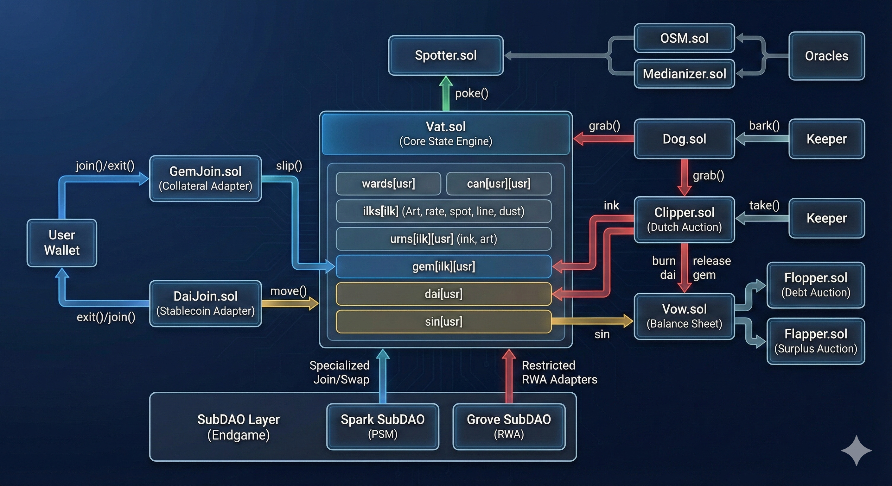
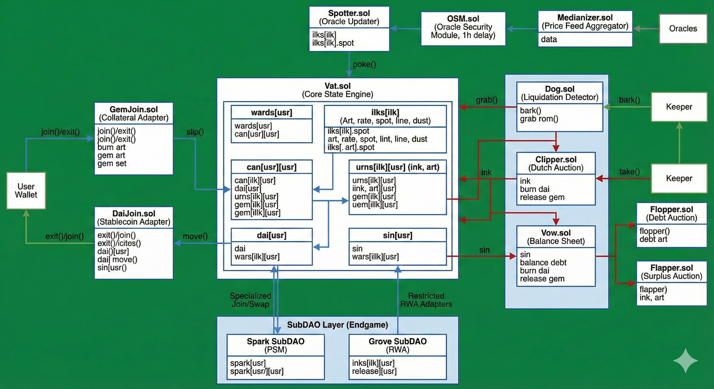
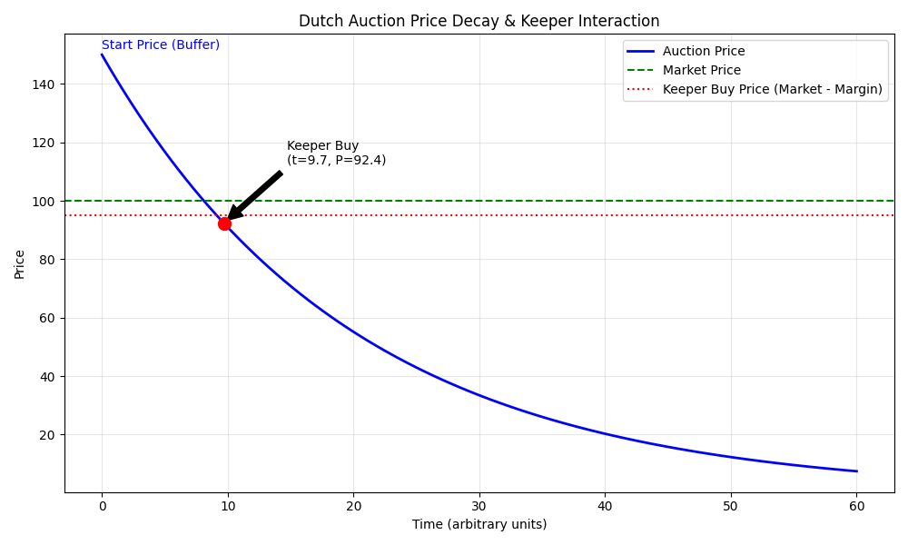
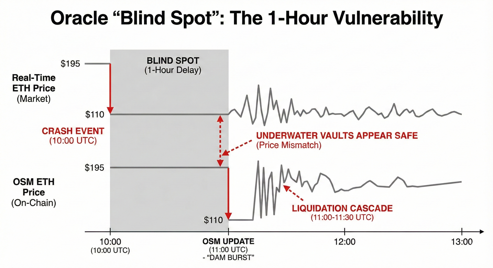
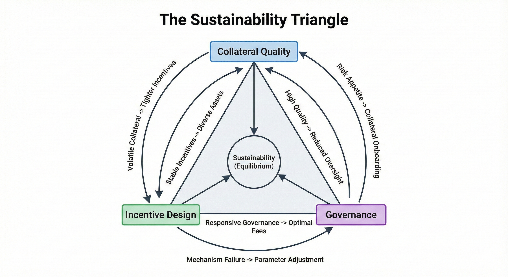
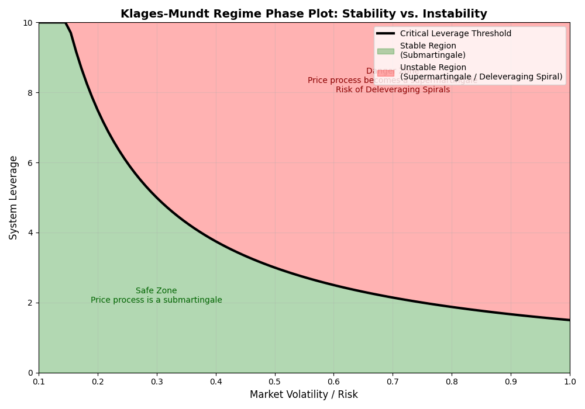

# Sky Ecosystem: The Mechanics of Solvency (Red Team Analysis)

**Authors**: Research Challenge Team
**Date**: January 2026
**Series**: Sky Research Series (Part I)

---

## Abstract

This paper interrogates the solvency architecture of the Sky Ecosystem (formerly MakerDAO). While the protocol markets itself as a decentralized credit facility, our analysis reveals a **fundamental decoupling** between its On-Chain Mechanism (The Vat) and its Off-Chain Reality (The Asset). We demonstrate that the ostensibly "immutable" `Vat` invariant is now merely a settlement layer for centralized liabilities. The transition from "Pure Crypto" to "Endgame Hybrid" is not an evolution of mechanism design; it is a **capitulation** to regulatory integration, effectively turning the protocol into an on-chain fintech wrapper.

> [!IMPORTANT]
> **Adversarial Scope**: This analysis ignores marketing claims. We treat the protocol as a black box and assume the worst-case scenario for all external dependencies (Circle, Oracles, Governance).

---

## 1. Introduction: The "Backed" Lie

In the Sky Ecosystem, "backing" is no longer about trustless value; it is about **permissioned access**.

The history of Sky is a history of retreating connectivity:
1.  **Pure Crypto (2017-2020)**: Backed by ETH. Trustless. (Failed Black Thursday).
2.  **Hybrid Emergency (2020-2023)**: Backed by USDC. Custodial. (Failed SVB).
3.  **Endgame (2024-Present)**: Backed by RWAs. Legal. (Unknowable).

We are analyzing a mechanism designed for **Phase 1** that is currently being forced to settle **Phase 3** assets. This mismatch is the core systemic risk.

*Figure 1: The Sky Solvency Architecture. A trustless accounting engine (Vat) filled with trusted assets.*

---

## 2. The Vat: A Ledger for Assets You Don't Own

The `Vat` is often praised as "engineering excellence." In reality, it is a **rigid straitjacket**. It enforces a mathematical invariant that is meaningless if the input variables are fictional.

### 2.1 The Invariant Illusion

$$ \text{ink} \cdot \text{spot} \ge \text{art} \cdot \text{rate} $$

*   $ink$: The collateral you *think* you have.
*   $spot$: The price the Oracle *says* it has.

If $ink$ is USDC (ablacklistable token) or RWA (a legal promise), this invariant provides **zero security**. The smart contract cannot "enforce" solvency if Circle blacklists the `Join` adapter. The `Vat` will act as if the money is there, while the market knows it is gone.

*Figure 2: The Vat Invariant. Statistically valid, legally increasingly irrelevant.*

### 2.2 The "Spot" Vulnerability

The system relies entirely on `spot` price to trigger safety.
*   **ETH-A**: `spot` is trusted because ETH is unseizable.
*   **RWA-001**: `spot` is a fiction maintained by governance. If the T-bills are seized, `spot` remains $>0$ until a multisig updates it.

**Verdict**: The `Vat` is a great calculator, but for RWAs, it is calculating fantasy.

---

## 3. Oracles: The Single Point of Failure

The protocol's "Epistemic Layer" is its most fragile component.

### 3.1 The Medianizer Theater

Sky uses a "Medianizer" to resist price manipulation.
*   **The Claim**: "Resistant to N/2 attacks."
*   **The Reality**: The feeds are permissioned entities (Chronicle, Chainlink). It is not a decentralized market of truth; it is a **consortium of friends**.

### 3.2 The OSM Lag

The Oracle Security Module (OSM) introduces a 1-hour delay.
This is not a "feature"; it is a **confession** that the system cannot handle real-time volatility.
*   **Black Thursday**: The OSM protected the *protocol* from bad data, but it slaughtered the *users* because the `spot` price lagged reality, creating a "Blindness Interval" where users couldn't save themselves.

*Figure 3: The Oracle Pipeline. A sophisticated mechanism to delay the inevitable.*

---

## 4. Liquidation: Selling the Unsellable

Liquidation operates on the assumption that **liquidity exists**.

### 4.1 The Clipper Fallacy

The Dutch Auction (`Clipper`) assumes that if price drops low enough ($P(t)$), a Keeper will buy.

$$ P(t) = P_{start} \cdot \text{decay}(t) $$

*   **Crypto**: Works (mostly).
*   **RWA**: **Fails completely**. You cannot "liquidate" a seized T-bill on-chain. There is no Keeper market for frozen assets. If RWA backing fails, the `Clipper` is useless.

*Figure 4: The Clipper Decay Curve. Functional for ETH, theoretical for everything else.*

### 4.2 Reconciliation via Dilution

When auctions fail (and they will for RWAs), the system mints SKY to cover the debt.
*   **The Problem**: If the RWA loss is substantial (e.g., $1B seizure), the resulting SKY inflation would be hyperinflationary. The "Backstop" is a myth if the hole is bigger than the SKY market cap.

*Figure 5: Emergency Shutdown. The "Nuclear Option" that admits the protocol has failed.*

---

## 5. The PSM: The Centralization Backdoor

The Peg Stability Module (PSM) is not "Alternative Backing." It is the **primary systemic risk**.

*   **Mechanism**: $1 \text{USDC} = 1 \text{USDS}$.
*   **The Lie**: "Hard Peg."
*   **The Truth**: **Regulatory Capture**. By pegging 1:1 to USDC, Sky inherently accepts all US regulations governing Circle.

> [!WARNING]
> **SVB Was a Warning Shot**: When USDC depegged to $0.88$, USDS followed instantly. This proved that Sky has **no sovereignty**. It is a leveraged ETF on Circle's bank accounts.

*Figure 6: PSM Arbitrage. The mechanism that imports systemic risk.*

---

## 6. Formal Stability: Moving the Goalposts

We apply Klages-Mundt not to prove stability, but to show **how** Sky cheats the submartingale condition.

### 6.1 Cheating the Beta ($\beta$)

The system requires collateral to be stable (Submartingale).
Crypto is **not** stable.
So instead of solving the "Crypto Stability" problem, Sky simply **replaced the collateral**.
*   They didn't build a better engine; they switched from "Gas" (ETH) to "Grid Power" (USDC).
*   This lowers volatility ($\sigma$) but introduces **Switch-Off Risk** (Censorship).

*Figure 7: Stability Regimes. Sky achieved the "Safe Zone" not by engineering, but by selling out to centralization.*

---

## Conclusion: A Solvency Theater

The Sky Backing Mechanism is "Trash" because it is a **Category Error**.
*   It uses **Trustless Tools** (Vat, Clipper) to manage **Trusted Assets** (USDC, RWA).
*   It incurs all the **overhead** of blockchain (gas, complexity) without gaining the **benefit** (censorship resistance).

**Ruthless Verdict**:
*   **Execution**: A+ (Contract logic is sound).
*   **Strategy**: F (The mechanism is misaligned with the asset base).
*   **Solvency**: **Conditional**. You are solvent as long as the US Government allows you to be.

*Part II will explore if this "Faustian Bargain" is at least profitable.*
