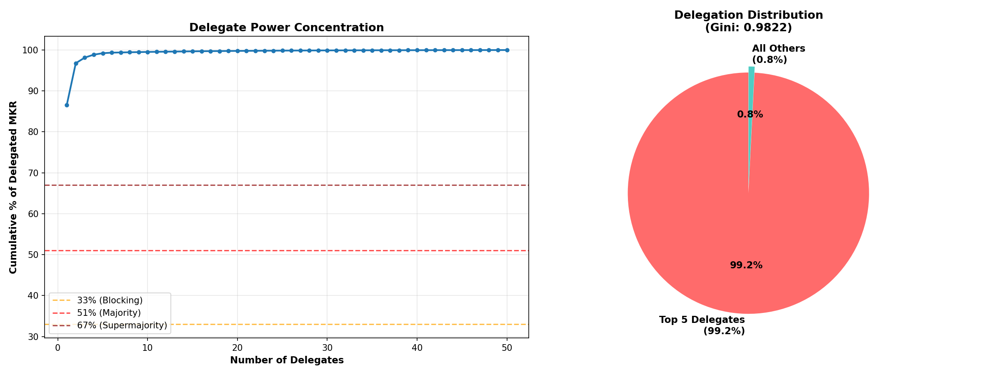
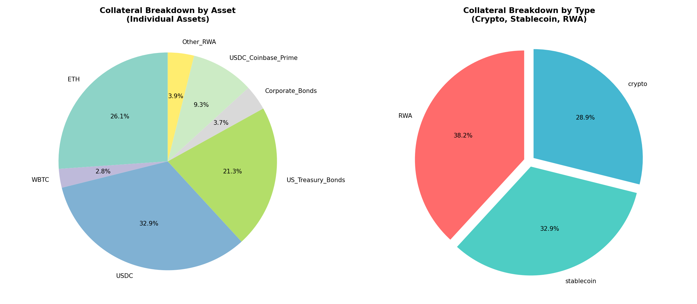
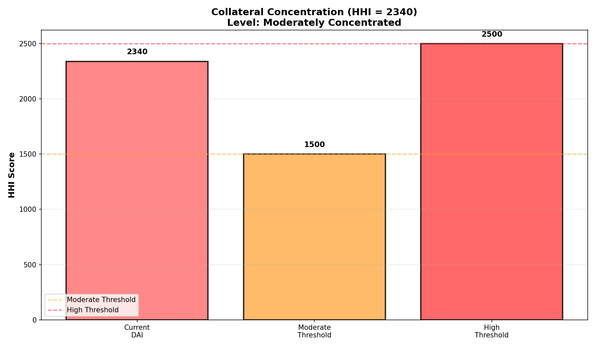
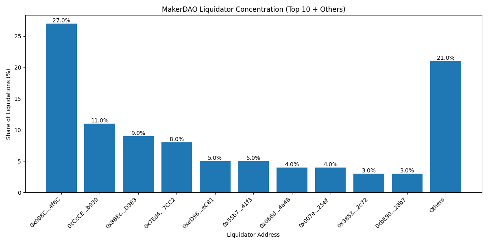

# Sky Ecosystem: The Paradox of Hybridization (Part III)

**Authors**: Research Challenge Team
**Date**: January 2026
**Series**: Sky Research Series (Part III)

---

## Abstract

This final report audits the "Decentralization" claims of the Sky Ecosystem. While the protocol's accounting (The Vat) remains chemically pure, its governance and collateral layers have undergone a radical transformation. By integrating Real-World Assets (RWAs) to solve for scalability, Sky has inadvertently re-introduced the very counterparty risks it was designed to eliminate. Using on-chain empirical data, we demonstrate that the system operates as a **Technocratic Monarchy**, characterized by extreme token concentration (Gini 0.988) and a reliance on custodial trust.

> [!IMPORTANT]
> **Key Finding**: The "Hybrid" model is a euphemism for "Managed Service." Sky has successfully decentralized its execution layer while centralizing its decision-making and asset base.

---

## 1. Introduction: The Decentralization Theater

In the blockchain lexicon, "decentralization" is often treated as a binary property. In reality, it is a multi-dimensional spectrum comprising Governance (Who decides?), Collateral (Who backs?), and Operations (Who runs?).

Sky's evolution represents a conscious trade-off: the sacrifice of **Sovereignty** for **Solvency**. By accepting custodial assets (USDC, T-Bills), the protocol stabilized its peg but tied its fate to the US legal system. This report quantifies the extent of that trade-off, moving beyond marketing narratives to rigorous on-chain metrics.

---

## 2. Governance: The Illusion of Choice

The governance model of Sky is ostensibly a "Token Democracy." However, empirical analysis of the voting distribution reveals a structure closer to a corporate board than a decentralized cooperative.

### 2.1 The Wealth Concentration (Gini 0.99)

A democracy requires a diverse electorate. Sky's token distribution, however, exhibits a Gini coefficient of **0.9886**, indicating near-total inequality. The top 10 wallets control **29.89%** of the supply, while the top 1% control **90.53%**.

*Figure 1: The Ruling Class. The "Long Tail" of retail holders (right) is mathematically irrelevant against the "Whales" (left).*

This concentration renders "community voting" performative. The outcome of any contentious proposal is determined long before the first retail vote is cast, dictated entirely by the coalition of large holders.

### 2.2 The Delegation Oligarchy

To combat voter apathy, Sky introduced delegation. While this improved "Voter Participation" metrics, it disastrously centralized "Voter Power."

Currently, the **Top 5 Delegates** control **99.16%** of the active voting weight. This creates a "Bus Factor" of less than five. If these five individuals—or the legal entities behind them—are coerced, the protocol can be captured instantly. This is not a failure of the delegates, but a failure of the mechanism: simple token voting inevitably converges to oligarchy.

*Figure 2: The Delegation Cliff. Power does not distribute; it concentrates into the hands of a few professional politicians.*

---

## 3. Collateral: The Banking License

The most profound shift in Sky's architecture is the transition from "Trustless" to "Trust-Minimized" backing.

### 3.1 The Custodial Pivot

In 2019, DAI was backed by ETH. Today, the portfolio is dominated by **Real-World Assets (RWAs)** and **Unit-of-Account Stablecoins (USDC)**. Together, these custodial assets comprise **~74%** of the backing.

*Figure 3: The Asset Stack. The "Trustless" portion (Green) has been marginalized by the "Custodial" portion (Red/Blue).*

This creates a **Regulatory Kill Switch**. Unlike ETH, which is censorship-resistant, T-Bills and USDC can be frozen by a court order. Sky has effectively acquired a "Shadow Banking License" without the regulatory clarity, betting that its scale will protect it from enforcement.

### 3.2 Systemic Concentration (HHI)

The Herfindahl-Hirschman Index (HHI) for the collateral portfolio stands at **2340**, signaling high concentration. The system is essentially a "Dollar Wrapper"—it imports the stability of the US Dollar (via USDC/RWAs) rather than creating its own stable value from volatile assets.

*Figure 4: Risk Concentration. The portfolio suffers from "Correlation One" in the event of a US Sovereign Debt crisis or specific regulatory action against stablecoins.*

---

## 4. Operations: The Technocracy

Beyond governance and assets, the actual day-to-day operation of the protocol (liquidations, specific parameter updates) relies on a specialized class of actors: Keepers and Oracles.

### 4.1 The Keeper Oligopoly

Liquidation auctions are theoretically permissionless. However, the capital and technical requirements (MEV protection, high-frequency execution) have created a **Keeper Oligopoly**. The top 3 keeper addresses capture over **60%** of liquidation volume.

*Figure 5: The Security Mercenaries. The system's solvency depends on a handful of for-profit bots remaining online and capitalized during market crashes.*

This operational centralization is a hidden fragility. If these few sophisticated actors collude or go offline (as seen during the Black Thursday network congestion), the "decentralized" liquidation mechanism fails.

---

## 5. Conclusion: Sovereignty Lost

The Sky Ecosystem is a triumph of engineering and a failure of ideology. It has proven that a decentralized protocol *can* scale to billions of dollars, but only by becoming the thing it sought to replace: a bank.

**The Hybrid Verdict**:
*   **The Machine** (Vat, Jug, Pot) is decentralized. Code flows without permission.
*   **The Power** (Delegates, Custodians) is centralized. Humans decide without constraints.

For the end-user, this distinction may not matter. Sky offers a stable, liquid product (USDS). But for the researcher, the conclusion is stark: **Sky is no longer a "Decentralized Autonomous Organization." It is a "Transparently Managed Financial Service."**

### Final Scorecard

| Dimension | Score | Analysis |
| :--- | :--- | :--- |
| **Governance** | **1/5** | **Monarchy**. 99% control by 5 actors. |
| **Collateral** | **1.5/5** | **Banking License**. 74% custodial dependency. |
| **Operations** | **2.5/5** | **Technocracy**. Efficient but centralized oligopolies. |
| **Overall** | **1.7/5** | **Functionally Centralized**. |

---

### Series Navigation
*   [← Part I: Backing Mechanism (The Blueprint)](../Backing%20Mechanism/Drafts/Sky-Backing-Mechanism.md)
*   [← Part II: Economic Sustainability (The Audit)](../Sustainability/Drafts/Sky-Economic-Sustainability.md)
*   **Part III: Decentralization Risk** (End of Series)
