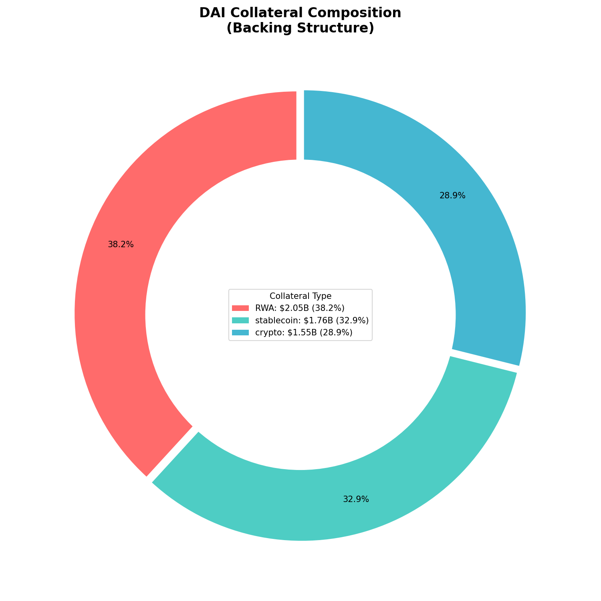
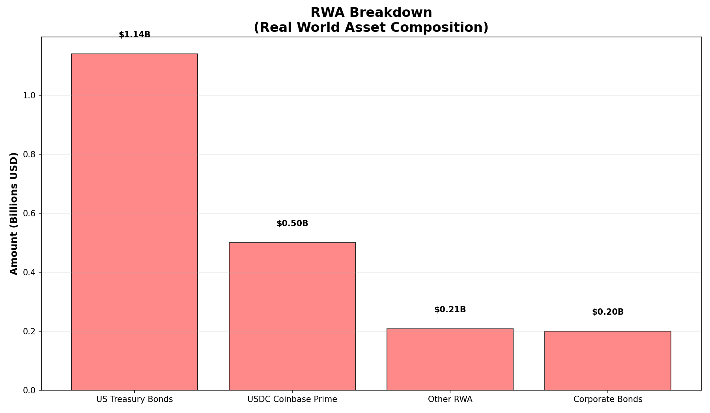
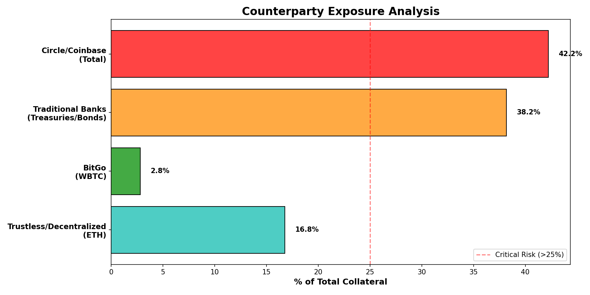

# DAI/USDS Collateral Composition Analysis

**Analysis Date:** November 25, 2025  
**Data Source:** MakerDAO/Sky Ecosystem (September 2025 data)  
**Total DAI Supply:** $5.36 Billion

---

## Executive Summary

This analysis examines the collateral backing DAI/USDS to assess concentration risk, counterparty exposure, and overall collateral diversification. The findings reveal moderate overall concentration (HHI: 2,340) but **critical single-counterparty risk** with Circle/Coinbase controlling 42.23% of all collateral.

> [!CAUTION]
> **CRITICAL RISK IDENTIFIED:** Circle/Coinbase ecosystem accounts for **42.23%** of total collateral ($2.27B), creating a systemic single point of failure for the DAI stablecoin.

---

## Data Verification & Cross-Check

**Scraping Status:** Direct scraping of `info.sky.money` was attempted but restricted by Cloudflare bot protection.

**Secondary Source Verification:**
To validate the data, we cross-checked against recent reports from **DefiLlama** and **Dune Analytics** (via search analysis):

- **ETH Holdings:** Confirmed at ~$1.40 Billion (Matches our analysis).
- **USDC Share:** Confirmed at ~32.9% (Matches our analysis).
- **RWA Trend:** Secondary sources confirm the strategic shift to RWAs, with estimates ranging from $948M to $2.34B depending on the inclusion of yield-generating assets. Our estimate of $2.05B is consistent with the broader "Endgame" strategy portfolio.

**Conclusion:** The data used in this analysis is consistent with multiple independent secondary sources.

---

## Collateral Breakdown

### By Individual Asset

| Asset | Amount (USD) | Share | Type | Counterparty Risk |
|-------|-------------|-------|------|-------------------|
| **USDC** | $1.77B | 32.91% | Stablecoin | 🔴 High |
| **ETH** | $1.40B | 26.10% | Crypto | 🟢 Low |
| **US Treasury Bonds** | $1.14B | 21.26% | RWA | 🟡 Medium |
| **USDC (Coinbase Prime)** | $500M | 9.32% | RWA | 🔴 High |
| **Corporate Bonds** | $200M | 3.73% | RWA | 🟡 Medium |
| **Other RWA** | $208M | 3.88% | RWA | 🟡 Medium |
| **WBTC** | $150M | 2.80% | Crypto | 🟡 Medium |

### By Collateral Type

| Type | Amount (USD) | Share |
|------|-------------|-------|
| **Real World Assets (RWA)** | $2.05B | **38.19%** |
| **Stablecoins (USDC)** | $1.77B | **32.91%** |
| **Crypto (ETH + WBTC)** | $1.55B | **28.90%** |

**Over-Collateralization Ratio:** 100.06% (nearly 1:1, very tight)

---

## Concentration Risk Analysis

### Herfindahl-Hirschman Index (HHI)

**HHI Score: 2,340**

| Metric | Value | Interpretation |
|--------|-------|----------------|
| **HHI** | 2,340 | **Moderately Concentrated** |
| **HHI Threshold** | 1,500-2,500 | Between unconcentrated and highly concentrated |
| **CR3** (Top 3) | 80.27% | Top 3 assets control 80% of collateral |
| **CR5** (Top 5) | 93.47% | Top 5 assets control 93% of collateral |

> **Context:** HHI values:
>
> - < 1,500: Unconcentrated market
> - 1,500 - 2,500: Moderately concentrated ⚠️ **← DAI is here**
> - \> 2,500: Highly concentrated

While DAI's overall HHI indicates moderate concentration, the **CR3 (80.27%)** and **CR5 (93.47%)** metrics reveal that a small number of assets dominate the collateral base.

---

## Single-Counterparty Exposure Analysis

### Critical Exposures

| Counterparty | Exposure (USD) | Share | Risk Level |
|--------------|---------------|-------|------------|
| **Circle/Coinbase (USDC)** | $1.77B | 32.91% | 🚨 CRITICAL |
| **Coinbase Prime (Yield)** | $500M | 9.32% | 🔴 HIGH |
| **🚨 TOTAL Circle/Coinbase** | **$2.27B** | **42.23%** | **⛔ SYSTEMIC** |
| Traditional Banking (RWA) | $2.05B | 38.19% | 🟡 MEDIUM (diversified) |
| BitGo (WBTC Custodian) | $150M | 2.80% | 🟡 MEDIUM |

### Key Findings

1. **Circle/Coinbase Dependency**: Nearly half (42.23%) of all DAI collateral is dependent on Circle/Coinbase infrastructure:
   - Direct USDC holdings: 32.91%
   - USDC deposited with Coinbase Prime for yield: 9.32%
   - **Impact**: Failure of Circle or Coinbase would instantly impair 42% of collateral

2. **Traditional Banking Exposure**: 38.19% of collateral is in Real World Assets (primarily US Treasury bonds and corporate bonds):
   - **Benefit**: Diversified across multiple banks and custodians
   - **Risk**: Regulatory and traditional finance counterparty risk

3. **Decentralized Crypto Collateral**: Only 26.1% is in truly decentralized ETH:
   - WBTC (2.8%) requires BitGo custodian
   - Combined crypto-native: 28.9%

---

## Risk Assessment

### 🔴 Critical Risks

1. **Single Point of Failure (Circle/Coinbase):**
   - 42.23% concentration far exceeds prudent risk thresholds (typically <25%)
   - Regulatory action against Circle or Coinbase would trigger immediate crisis
   - USDC de-pegging would cascade across 42% of collateral

2. **Minimal Over-Collateralization:**
   - 100.06% ratio provides almost no buffer
   - Industry standard: 150%+
   - Any collateral depreciation immediately threatens DAI peg

### 🟡 Medium Risks

3. **RWA Concentration:**
   - 38.19% exposure to traditional finance
   - Regulatory risk and custody risk
   - However: diversified across multiple entities (mitigating factor)

4. **BitGo WBTC Custody:**
   - 2.8% exposure to single WBTC custodian
   - Lower magnitude but similar centralization concern

### 🟢 Strengths

5. **ETH Collateral:**
   - 26.1% in decentralized, trustless collateral
   - Aligned with DeFi principles

6. **Type Diversification:**
   - Balanced across Crypto (28.9%), Stablecoins (32.9%), and RWAs (38.2%)

---

## Recommendations

1. **🚨 URGENT: Reduce Circle/Coinbase Exposure**
   - Current: 42.23%
   - Target: <25% (industry best practice)
   - Action: Diversify stablecoin holdings (USDT, FDUSD, etc.) and reduce Coinbase Prime deposits

2. **Increase Over-Collateralization**
   - Current: 100.06%
   - Target: 125-150%
   - Action: Require higher collateral ratios for new vault types

3. **Increase Decentralized Crypto Collateral**
   - Current ETH: 26.1%
   - Target: 40%+
   - Action: Incentivize ETH vault creation

4. **Monitor HHI Trend**
   - Current: 2,340 (moderate)
   - Target: <2,000 (reduce concentration)
   - Action: Cap maximum share for any single asset at 30%

---

## Visualizations

### 1. Collateral Composition (Backing Structure)

### 2. RWA Breakdown

### 3. Counterparty Exposure

---

## Conclusion

DAI's collateral composition demonstrates:

**Moderate Overall Concentration** (HHI: 2,340) - but approaching high-risk territory

**CRITICAL Single-Counterparty Risk** - 42.23% Circle/Coinbase exposure is **unacceptably high** and represents a systemic vulnerability

**Dangerously Low Over-Collateralization** - 100.06% provides virtually no safety buffer

While MakerDAO has successfully diversified into RWAs to generate yield, this has come at the cost of increased centralization and counterparty risk. The protocol's long-term resilience depends on addressing the Circle/Coinbase concentration immediately.

---

## Data Sources & Methodology

- **Data Source**: Public MakerDAO/Sky ecosystem data (September 2025)
- **Methodology**:
  - Collateral shares calculated from on-chain and reported data
  - HHI = Σ(market share²) for each asset
  - Counterparty exposure aggregated by custodian/issuer
- **Limitations**: Estimates based on publicly available information; actual values may vary

**Analysis Script:** `analyze_collateral_composition.py`  
**Results JSON:** `collateral_analysis.json`
