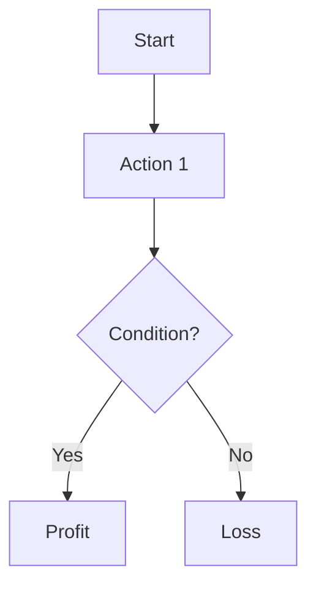

## 3. Modelling

### Scenario: [SCENARIO_NAME]
*Objective: Model the cost of attack vs. potential profit for [SPECIFIC_ATTACK].*

#### Assumptions
*   **Total Value Locked (TVL)**: $[VALUE]
*   **Attacker Capital ($C$)**: $[VALUE]
*   **Critical Threshold**: [Value at which attack succeeds]

#### The Attack Loop

#### Cost vs. Profit Analysis

$$ \text{Cost} = [FORMULA] $$

$$ \text{Profit} = [FORMULA] $$

**Feasibility Conclusion**:
*   If Cost > Profit, the system is **Secure**.
*   If Profit > Cost, the system is **Vulnerable**.
