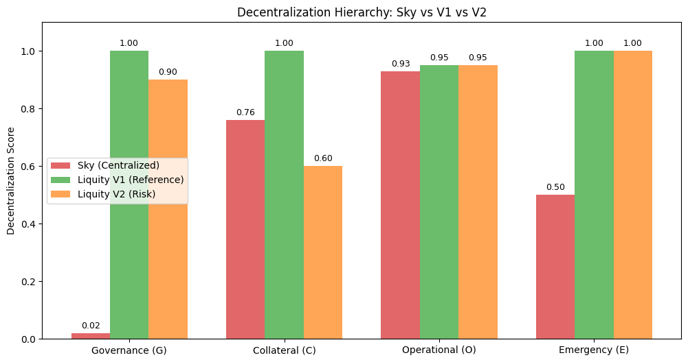
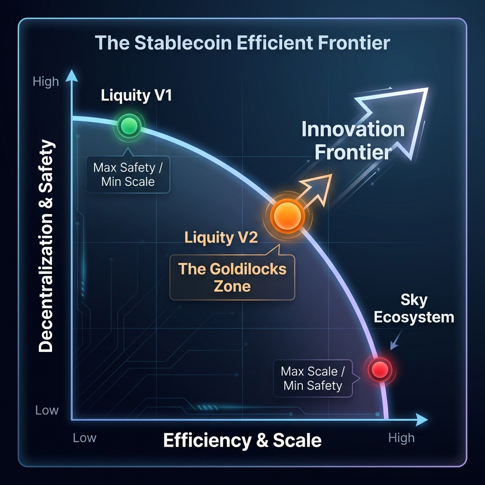

# The Stablecoin Trilemma: Efficiency, Safety, & Scale

**A Comparative Analysis of Sky Ecosystem, Liquity V1, and Liquity V2**

**Date:** January 5, 2026  
**Authors:** Research Challenge Team  
**Framework Version:** v3.1 (Triangular Comparison)

---

## 1. Executive Verdict: The Three Species

The stablecoin landscape is no longer a binary choice between "Centralized" and "Decentralized". Our analysis reveals three distinct architectural species, each optimizing for a specific vertex of the **Impossible Trinity** ([Catalini & de Gortari, 2021](#ref-catalini-degortari)).

| Feature | **Sky Ecosystem** (The Bank) | **Liquity V1** (The Vault) | **Liquity V2** (The Hybrid) |
|:---|:---|:---|:---|
| **Archetype** | Regulatory Neo-Bank | Cypherpunk Public Utility | Pragmatic DeFi Protocol |
| **Primary Goal** | **Scale & Efficiency** | **Absolute Safety** | **Yield & Growth** |
| **Backing** | Custodial (USDC/RWA) | Trustless (ETH) | Federated (Kinetic) |
| **Governance** | Plutocratic (Active) | None (Immutable) | Limited (Incentive-Only) |
| **Risk Profile** | Censorship / Regulatory | Economic Stagnation | LST Contagion |
| **Score (Decent.)** | � **0.50** (Fail) | 🟢 **0.99** (Perfect) | � **0.85** (Compromised) |
| **Score (Sust.)** | � **High** (Active Yield) | � **Broken** (0% Yield) | 🟢 **High** (User-Set Yield) |

> **The Trade-Off Map:**
>
> * **Sky** sacrifices Safety for **Efficiency**.
> * **Liquity V1** sacrifices Efficiency for **Safety**.
> * **Liquity V2** sacrifices "Pure Safety" for **Scale**.

---

## 2. Sustainability Analysis (The Business Case)

**Question:** *Can the protocol survive in a high-rate environment?*

### Sky Ecosystem: The Profit Machine

* **Mechanism:** Active Treasury Management. Sky captures the spread between RWA yields (~3.63%) and DSR (1.25%).
* **Ecosystem Size:** **$10.62B** (On-chain verified, Block 24,171,462)
* **Result:** Massive surplus ($60M+) and ability to vote-buy growth.
* **Verdict:** **Resilient.** It acts like a sovereign wealth fund.

### Liquity V1 (LUSD): The Stagnation Trap

* **Mechanism:** Zero-interest loans. Protocol earns only one-time fees.
* **Result:** **Economic Failure.** In a 5% rate world, LUSD supply collapsed because it pays 0% yield. Users fled to Treasuries. LUSD is safe, but "dead".
* **Verdict:** **Obsolete** (Economically).

### Liquity V2 (BOLD): The Market Fix

* **Mechanism:** User-Set Interest Rates. Borrowers compete for liquidity, generating real yield for BOLD holders.
* **Result:** **Competitive.** It matches the Risk-Free Rate (RFR) indigenously.
* **Verdict:** **Sustainable.** It solves V1's flaw but introduces complexity.

---

## 3. Decentralization Analysis (The Sovereignty Case)

**Question:** *Who controls the money?*

*Figure 1: The Hierarchy of Trust. Sky (Red) relies on legal trust. Liquity V2 (Orange) relies on LST trust. Liquity V1 (Green) relies on Math.*

### Sky Ecosystem: Effectively Centralized

* **Governance:** Top-1 delegate holds 86% of voting power ([Internal Research, 2026](#ref-sky-decentralization)).
* **Collateral:** **37.6% USDC** ($3.99B in PSM Pocket). On-chain verified.
* **Verdict:** Sky is a "Crypto-Wrapped Bank". Moderate counterparty risk.

### Liquity V1: The Platinum Standard

* **Governance:** 0 Admin Keys. 0 Governance Votes.
* **Collateral:** 100% ETH. No counterparty risk.
* **Verdict:** The only truly "Unstoppable" money.

### Liquity V2: The Calculated Risk

* **Governance:** No admin keys, but voting directs incentives (controlling liquidity).
* **Collateral:** Accepts LSTs (wstETH).
  * *Risk:* If Lido DAO censors, Liquity V2 is affected.
* **Verdict:** **Trust-Minimized**, not Trustless. A pragmatic compromise to unlock LST liquidity.

---

---

## 4. Backing Analysis (The Solvency Case)

**Question:** *How does the system physics enforce solvency?*

### Sky Ecosystem: The Rehypothecated Dollar

* **Mechanism:** 1:1 Peg with USDC/Treasuries. Dependent on Circle/Coinbase solvency.
* **Risk:** **Custodial Seizure.** If the US Govt sanctions the PSM, the backing freezes.
* **Verdict:** Safe from market volatility, vulnerable to state actors.

### Liquity V1: The Hard Rock

* **Mechanism:** 110% ETH Over-collateralization. Immutable liquidation logic.
* **Risk:** **Price Volatility.** Extreme ETH crash could theoretically outpace liquidations (never happened in practice).
* **Verdict:** The hardest money in DeFi. Limited by ETH's market cap.

### Liquity V2: The Kinetic Federation

* **Mechanism:** **Hub-and-Spoke.** Isolates risk into branches (WETH, rETH). System solvency is the *sum* of its parts, but failure is compartmentalized.
* **Risk:** **Complex Contagion.** LST de-peg events are handled by the "Unbackedness Routing" algorithm.
* **Verdict:** **Antifragile.** It turns LST risk into a localized pricing problem (interest rates) rather than a system-wide solvency crisis.

---

## 5. The Efficient Frontier

We visualize the design space as a curve where you cannot maximize all variables.

*Figure 2: The Stablecoin Trilemma Efficient Frontier. Liquity V2 expands the curve by balancing Safety and Scale.*

**Strategic Insight:**

* **Liquity V1** is the *theoretical limit* of decentralization.
* **Sky** is the *theoretical limit* of efficiency without being a fiat bank.
* **Liquity V2** attempts to push the frontier outward, seeking the "Goldilocks Zone".

---

## 6. Final Recommendations

### For Different user Profiles

| User Type | Recommendation | Why? |
|:---|:---|:---|
| **Yield Farmer** | **Sky (USDS)** | Highest liquidity, RWA backing, "Too Big To Fail". |
| **Cypherpunk** | **Liquity V1 (LUSD)** | Zero trust required. Immune to regulation. |
| **Sophisticated User** | **Liquity V2 (BOLD)** | High yield potential, but requires monitoring LST risks. |

### The Future

The industry is bifurcating. Sky is merging with Traditional Finance (TradFi) ([FSB, 2023](#ref-fsb-cryptoassets)). Liquity is retracting into "Hyper-DeFi". V2 is the bridge attempt ([Liquity, 2025](#ref-liquity-v2-docs)). **We recommend maintaining exposure to distinct species to hedge regulatory vs. economic risks.**

---

### Artifact Index

* [Sky Sustainability Profile](Sky%20Ecosystem/Sustainability/Artifact/Sky_Sustainability_Profile_Jan2026.md)
* [Sky Decentralization Profile](Sky%20Ecosystem/Decentralization/Artifact/Sky_Decentralization_Profile_Jan2026.md)
* [Sky Backing Profile](Sky%20Ecosystem/Backing%20Mechanism/Artifact/Sky_Backing_Profile_Jan2026.md)
* [Liquity V1 Sustainability Profile](Liquity/01_V1_LUSD/Sustainability/Artifact/Liquity_V1_Sustainability_Profile.md)
* [Liquity V1 Decentralization Profile](Liquity/01_V1_LUSD/Decentralization/Artifact/Liquity_V1_Decentralization_Profile.md)
* [Liquity V2 Economic Resilience](Liquity/02_V2_BOLD/Sustainability/Artifact/Liquity_V2_Economic_Resilience.md)
* [Liquity V2 Decentralization Analysis](Liquity/02_V2_BOLD/Decentralization/Artifact/Liquity_V2_Decentralization_Analysis.md)
* [Liquity V2 Backing Profile](Liquity/02_V2_BOLD/Backing%20Mechanism/Artifact/Liquity_V2_Backing_Profile.md)
* [Liquity V2 Backing Deep Dive](Liquity/02_V2_BOLD/Backing%20Mechanism/Artifact/Liquity_V2_Backing_DeepDive.md)

---

## References

Catalini, C., & de Gortari, A. (2021). *[On the Economic Design of Stablecoins](https://www.nber.org/papers/w29115)*. NBER Working Paper No. 29115.

Internal Research. (2026). *[Sky Decentralization Profile](Sky%20Ecosystem/Decentralization/Artifact/Sky_Decentralization_Profile_Jan2026.md)*. Canonical Artifact.

MakerDAO. (2017). *[The Maker Protocol: MakerDAO's Multi-Collateral Dai (MCD) System](https://makerdao.com/en/whitepaper/)*. Technical Whitepaper.

Financial Stability Board. (2023). *[Regulatory Framework for Crypto-Assets](https://www.fsb.org/2023/07/imf-fsb-synthesis-paper-policies-for-crypto-assets/)*. FSB Synthesis Paper.

Liquity. (2025). *[Liquity V2 Technical Documentation](https://docs.liquity.org/v2/)*. Protocol Documentation.
