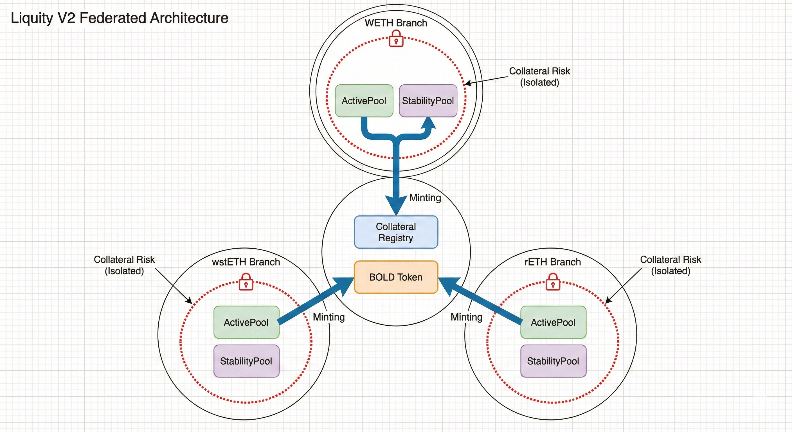
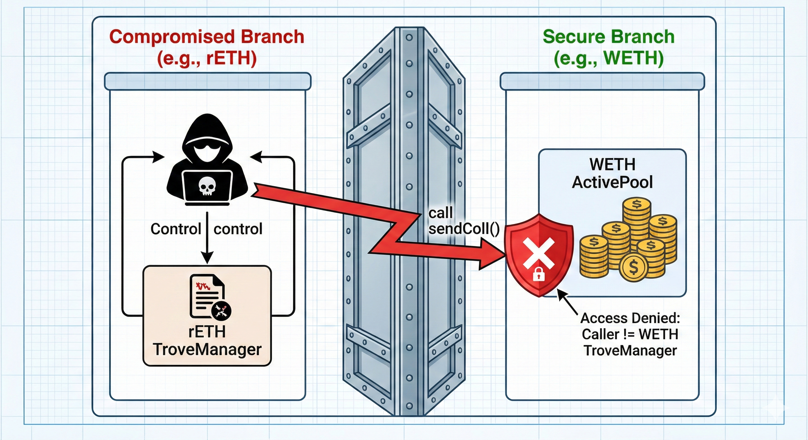
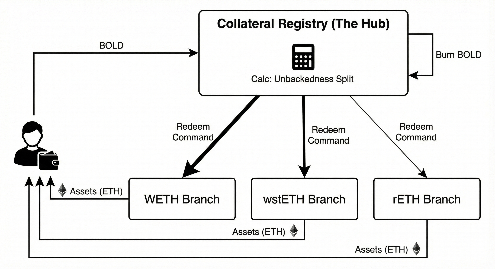
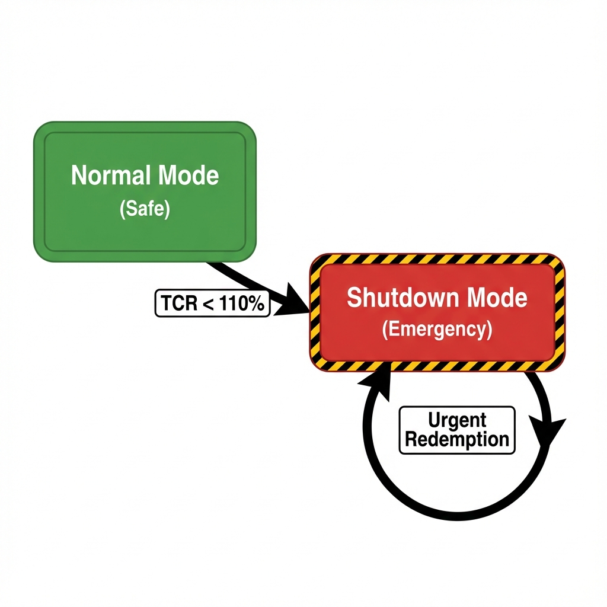

# Liquity V2 (BOLD): Kinetic Solvency & Backing Mechanics (Part I)

**Authors**: Research Challenge Team
**Date**: January 2026
**Series**: Liquity Research Series (Part I)

---

## Abstract

This report analyzes the **Kinetic Solvency** of Liquity V2 (BOLD). Unlike the "Siloed" model of V1 (ETH-only), V2 introduces a **Federated Solvency** architecture. It compartmentalizes risk into isolated "Branches" (e.g., WETH, wstETH) while unifying liquidity via a global liability token (BOLD). We demonstrate that the core innovation—**Algorithmic Unbackedness Routing**—transforms redemption from a simple peg mechanism into a "Self-Healing" immune system that automatically targets and creates a vacuum for the system's riskiest debt. This is coupled with a **User-Set Interest Rate** mechanism that turns the cost of capital into a localized solvency defense budget.

> [!IMPORTANT]
> **Critical Lens**: This analysis focuses on the "Physics" of the liquidation engine. We assume a hostile environment where individual collateral assets (LSTs) may fail completely.

---

## 1. Introduction: The Federation Model

Liquity V2 solves the "Unified Debt Trilemma" (Scalability vs. Solvency vs. Contagion) by inverting the standard Multi-Collateral logic. Instead of pooling assets to back a liability (MakerDAO), it **pools liabilities to monetize isolated assets**.

### 1.1 The Solvency Invariant

The global solvency of BOLD is not a simple sum. It is the minimum solvency of its independent branches:

$$ \text{Solvency}_{\text{Global}} = \min(\text{Branch}_1, \text{Branch}_2, ... \text{Branch}_n) $$

* **The Hub (Registry):** Manages the global liability (BOLD) and routes redemptions. Holds **zero collateral**.
* **The Spokes (Branches):** Independent markets (WETH, rETH) that hold collateral and manage their own risk parameters.

---

## 2. Kinetic Failure Analysis: The Contagion Firewall

In a standard "Unified Vat" model, a failure in one asset class (e.g., rETH hack) dilutes the backing of all users. Liquity V2 employs a **Bulkhead Security Pattern**.

### 2.1 The Firewall Logic

* **Isolation:** The `ActivePool` for WETH is cryptographically distinct from the rETH pool.
* **Failure Mode:** If rETH goes to zero, the rETH branch becomes insolvent and shuts down. The WETH branch remains untouched.
* **Impact:** Users who did not opt-in to rETH risk suffer **zero loss**.

---

## 3. The Kinetic Engine: Unbackedness Routing

The "Hard Peg" (Redemption) is the system's primary kinetic defense. V2 transforms redemption from a user-choice swap into an algorithmic solvency tool.

### 3.1 Unbackedness ($U$)

The system defines "Risk" as debt that is not covered by the Stability Pool:

$$ U_i = \max(0, \text{RecordedDebt}_i - \text{SPBalance}_i) $$

* **Secure Branch ($U=0$):** Stability Pool > Debt. No risk of bad debt.
* **Fragile Branch ($U>0$):** Debt > Stability Pool. Exposed to liquidation failure.

### 3.2 The Routing Algorithm

When a user redeems BOLD, the Registry routes the sell pressure proportionally to the risk:

$$ R_i = \frac{U_i}{\sum U_j} \cdot R_{\text{total}} $$

* **Result:** The redemption automatically targets the "Weakest Links," contracting their supply and restoring global equilibrium. This acts as a **Darwinian Solvency Mechanism**.

---

## 4. Solvency Defense: User-Set Rates

Liquity V2 replaces governance-set rates with a free market for **Redemption Insurance**.

### 4.1 The Price of Protection ($\theta$)

* **Mechanism:** Borrowers set their own interest rate.
* **Queue Position:** Redemptions always hit the lowest-rate borrowers first (LIFO).
* **Trade-off:**
  * **Low Rate:** "I am the First Responder." (High Risk).
  * **High Rate:** "I am the Protected Core." (Safety Premium).

### 4.2 The Stability Pool Yield Split

75% of all interest revenue is routed directly to the local Stability Pool ([Liquity, 2025](#ref-liquity-v2-docs)).

* **Feedback Loop:** High Risk $\rightarrow$ Borrowers raise rates to buy safety $\rightarrow$ High Yield for Depositors $\rightarrow$ Deep Stability Pool.
* **Result:** The "Defense Budget" scales linearly with the threat level.

---

## 5. Terminal Defense: Granular Shutdown

If a specific asset fails (e.g., Oracle freeze or Economic Insolvency), the system initiates a **Granular Shutdown**.

### 5.1 Trigger Conditions

1. **Economic:** TCR < 110% (Event Horizon).
2. **Epistemic:** Oracle Timeout (> 4 hours).

### 5.2 Urgent Redemption Mode

Once triggered, the branch enters "Survival Mode":

* **Rule Change:** The sorted queue is bypassed.
* **Targeting:** Arbitrageurs can cherry-pick *any* Trove to close.
* **Incentive:** 0% Fee + **Collateral Bonus**.
* **Goal:** Rapid unwinding of the specific insolvent market without pausing the global protocol.

---

## 6. Conclusion

Liquity V2 represents the evolution from **Monolithic Solvency** to **Modular Liability**. By unbundling the stablecoin from its backing, it allows for permissionless scaling without the contagion risks inherent in unified debt models.

* **Kinetic Integrity:** **High**. The "Self-Healing" redemption mechanism is a major theoretical advance.
* **Asset Risk:** **Isolated**. Users only underwrite the risk of the specific branch they engage with.

---

### Series Navigation

* **Part I: Kinetic Solvency (Backing)** (You are here)
* [Part II: Economic Sustainability (The Audit)](../../Sustainability/Artifact/Liquity_V2_Economic_Resilience.md)
* [Part III: Decentralization Risk (The Governance)](../../Decentralization/Artifact/Liquity_V2_Decentralization_Analysis.md)

---

## References

Liquity. (2025). *[Liquity V2 Technical Documentation](https://docs.liquity.org/v2/)*. Protocol Documentation.

Internal Research. (2026). *[Liquity V2 Decentralization Analysis](../../Decentralization/Artifact/Liquity_V2_Decentralization_Analysis.md)*. Canonical Artifact.
