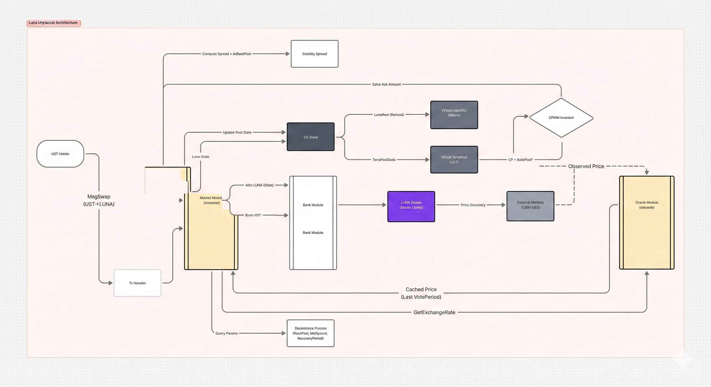
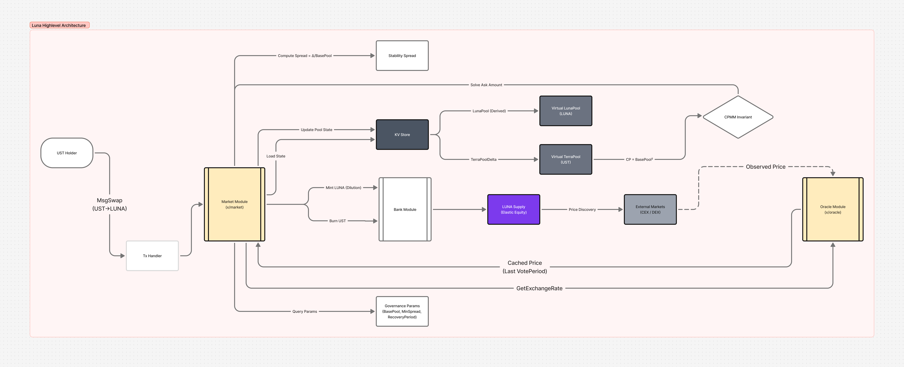
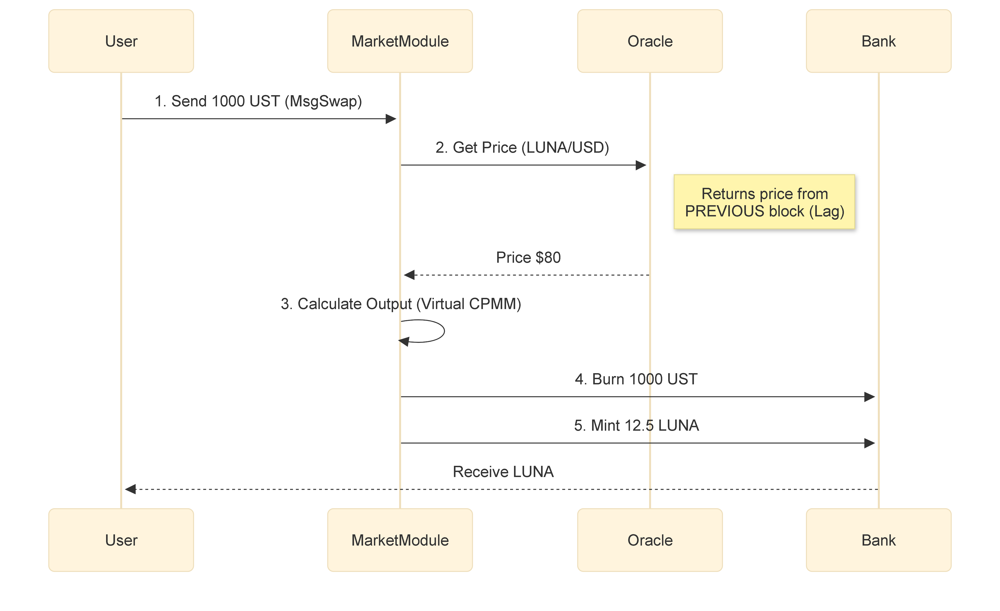
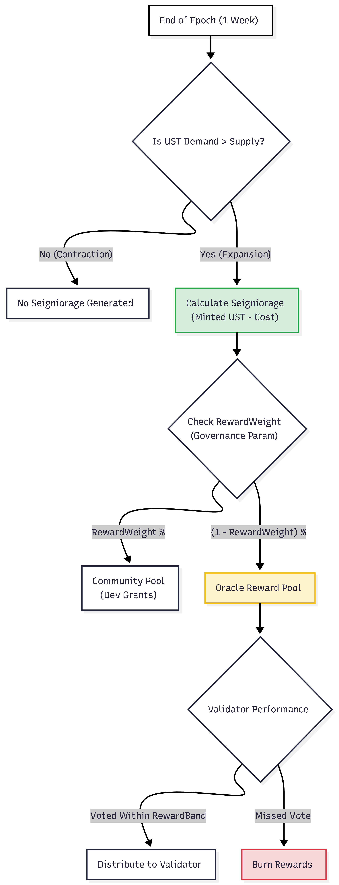

# Terra (UST): Backing Mechanism Deep Dive (Pillar I)

**Authors**: Research Challenge Team
**Date**: January 2026
**Series**: Terra Research Series (Part II)
**Framework**: [General Backing Framework](../../../01_frameworks/general_backing_framework.md)

---

## 1. System Architecture: The Virtual AMM

Unlike collateralized stablecoins (MakerDAO, Liquity) that hold resilient assets in a vault, Terra operates as a **Virtual Automated Market Maker (VAMM)**. The "Backing" is not an asset, but a **Liquidity Commitment**: the protocol promises to mint $1 of LUNA for every 1 UST burned, regardless of market conditions.

*Figure 1.0: Conceptual Overview of the Virtual AMM Model*

### 1.1 The Market Module (`x/market`)

The core engine is the `x/market` module. It maintains two **Virtual Pools** that simulate liquidity depth to calculate slippage.

* **Reflexivity:** The pools do not hold tokens. They are mathematical variables (`TerraPoolDelta`) that track the deviation from equilibrium.
* **Constant Product:** The pricing follows a $CP = BasePool^2$ invariant.

*Figure 1.1: Virtual Pool Architecture showing the interaction between User and x/market state*

*Figure 1.2: Atomic Execution Flow of a Swap Transaction*

---

## 2. Kinetic Solvency: The Death Spiral Mechanics

The system's solvency relies entirely on the **Absorption Assumption**: *Market demand for LUNA must always exceed the sell pressure from UST redemptions.*

### 2.1 The Stability Spread (Damping Factor)

To prevent bank runs, the protocol charges a dynamic specific tax called the **Stability Spread**.

*Figure 2.1: Stability Spread mechanics demonstrating cost-of-exit expansion during de-pegs*

$$Spread = \max(MinSpread, \frac{UST_{Sold}}{BasePool})$$

* **Intent:** As selling pressure increases, the cost to exit (Swap UST -> LUNA) increases linearly.
* **Flaw:** The spread decays over time (`PoolRecoveryPeriod` ~24h). If sell pressure is sustained but slow, the spread resets, allowing continuous value extraction at low cost.

### 2.2 The Hyper-Inflationary Trigger

When confidence breaks, the mechanism enters a deterministic feedback loop:

1. **Peg Break:** UST drops to $0.90.
2. **Arb Opportunity:** Traders buy UST for $0.90, swap for $1.00 LUNA, and dump LUNA.
3. **LUNA Crash:** The dump lowers LUNA price.
4. **Inflation:** To cover the *next* $1.00 redemption, the protocol must mint *more* LUNA tokens than before.
5. **Recursion:** More LUNA -> Lower Price -> More Minting -> Infinite Supply.

This is not a bug; it is the correct function of the code to defend the $1.00 peg at the expense of LUNA equity.

---

## 3. The Sensor: Oracle Latency Risk

Terra relies on a **Weighted Median** vote from validators to price LUNA.

* **VotePeriod:** 5 Blocks (~30 seconds).
* **Vulnerability:** The price is always **stale**.
  * *Attack:* If LUNA crashes 20% in 15 seconds, the Oracle reports the *old* high price.
  * *Exploit:* Attackers swap UST for "overpriced" LUNA before the Oracle updates, effectively looting the system of more value than the market supports.

---

## 4. Conclusion: The Unbacked State

Terra V1 proved that **Algorithmically Enforced Convertibility** is not a substitute for **Collateral**.

* **Backing:** None (Endogenous).
* **Solvency:** Dependent on external market sentiment (LUNA demand).
* **Verdict:** The system operates as a **Fractional Reserve Bank** where the reserve asset (LUNA) is correlated with the liability (UST).

---

### Series Navigation

* [Part I: Backing Profile](Terra_Backing_Profile.md)
* **Part II: Backing Deep Dive** (You are here)
* [Part III: Sustainability Profile](../../Sustainability/Artifact/Terra_Sustainability_Profile.md)
* [Part IV: Decentralization Profile](../../Decentralization/Artifact/Terra_Decentralization_Profile.md)

---

## References

Terraform Labs. (2021). *[Terra Core Repository](https://github.com/terra-money/classic-core)* via `x/market`.

Internal Research. (2026). *[Terra Protocol Analysis](../../../../../analysis/Terra/Backing%20Mechanisms/Article_Backing.md)*. Draft Analysis.
