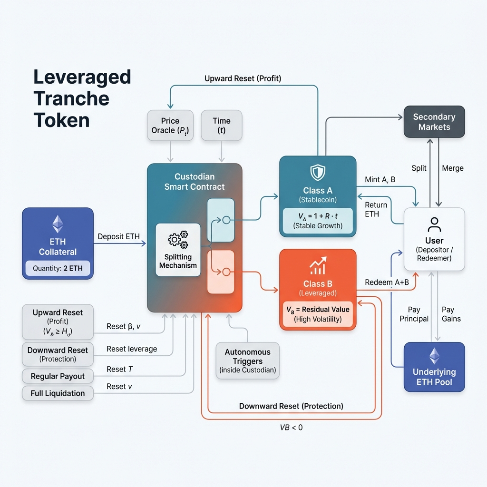
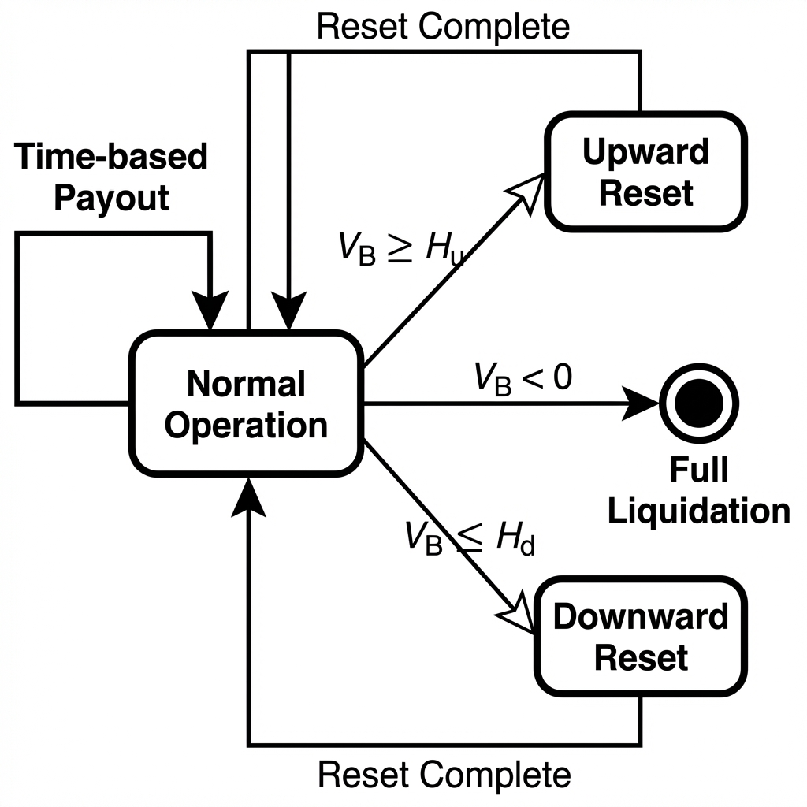

---

# Designing a Stablecoin with a Highly Volatile Crypto Reserve

## A Structural Design Under Irreducible Price Risk

*Canonical Version — Citation-Anchored (Frozen)*

---

#### TL;DR

* This design draws heavy inspiration from **classical securitization**, particularly the way structured finance products (like CDOs, MBS, or dual-purpose funds) partition risk across different classes of claims against the same underlying asset pool.
* It proposes a non-custodial stablecoin design backed by highly volatile crypto assets (e.g. ETH/BTC) that does not try to eliminate volatility — instead it internalizes and contains it through:

* Dual-tranche structure → Senior (Class A) claim aims for stability, Junior (Class B) absorbs almost all volatility and leverage risk
* Autonomous reset rules at fixed NAV barriers (upward rebalance + downward partial payout + reverse split) instead of continuous market liquidations
* Strict on-chain solvency invariant enforced by smart contract (no human discretion)

* **What it guarantees (only under continuous price paths like Black-Scholes)**:
* Deterministic solvency, automatic deleveraging, and bounded losses for senior holders.
What it explicitly does NOT guarantee:
* Protection against price jumps (a single gap can jump over barriers → instant insolvency), perfect oracles, or zero losses for seniors.

---

#### TL;DR

* **Concept**: Applies **structured finance** principles (securitization) to volatile collateral vs. eliminating volatility.
* **Mechanism**:
  * **Dual-Tranche**: Senior (Stability) vs. Junior (Volatility/Leverage) claims.
  * **Autonomous Resets**: Fixed NAV barriers trigger rebalancing/payouts instead of market liquidations.
  * **Solvency Invariant**: Deterministically enforced by smart contract.
* **Guarantees**: Solvency and bounded losses (under continuous prices).
* **Non-Guarantees**: Zero-loss or protection against discontinuous jumps/oracle failure.

---

## Abstract

Designing a stablecoin backed by a highly volatile cryptocurrency presents a structural challenge: the collateral’s price exhibits high variance, fat tails, and discontinuous jumps that directly threaten solvency. Unlike systems backed by non-volatile reserves, volatility cannot be eliminated by assumption and must instead be explicitly contained. This paper presents a design framework in which collateral volatility is internalized through deterministic capital structure (**securitization**) rather than suppressed through discretionary control or continuous liquidation markets. Building on dual-tranche stablecoin architectures formalized in the literature [Designing Stablecoins by Dai, Kou, Yang, and co-authors](#ref-dai), the design partitions risk between senior and junior claims, employs autonomous reset rules, and enforces on-chain solvency invariants. The result is not a risk-free stablecoin, but a system with bounded loss behavior under continuous price paths and explicitly characterized failure modes under jump risk, consistent with stochastic analyses of noncustodial stablecoins ([Klages-Mundt et al., 2020](#ref-klages20); [Klages-Mundt & Minca, 2022](#ref-klages22)).

---

## 1. Problem Statement: Stability Under Volatile Collateral

Let $P_t$ denote the market price of a crypto reserve asset such as ETH or BTC. Empirically, $P_t$ exhibits high variance, heavy tails, and sudden jumps, properties well captured by jump-diffusion models rather than continuous diffusions ([Kou, 2002](#ref-kou02); [Cai & Kou, 2011](#ref-cai)).

A stablecoin backed by such an asset must maintain a value near a fixed reference (e.g., $1) despite these dynamics.

The fundamental constraint is **solvency**, not peg maintenance:

$$C_t P_t \ge D_t \tag{1}$$

where $C_t$ is collateral quantity and $D_t$ is outstanding stablecoin liability.

This constraint must hold on-chain, deterministically, and without discretionary intervention. Any design that violates it, even transiently, is insolvent by construction.

Volatility cannot be assumed away. It must be structurally absorbed.

---

## 2. Design Principle: Volatility Containment, Not Suppression

There are only three coherent approaches to volatile collateral:

1. Externalize volatility via liquidation into markets
2. Absorb volatility reflexively via endogenous collateral
3. Internalize volatility through capital structure and payoff design

Liquidation-based systems such as MakerDAO adopt the first approach ([MakerTeam, 2017](#ref-maker)), while reflexive algorithmic systems historically attempted the second with catastrophic outcomes ([Wong et al., 2022](#ref-wong)). **This work adopts the third approach, consistent with risk-based stablecoin models**

> **Principle:**
> Volatility is conserved. Stability is achieved by reallocating risk, not eliminating it.

---

## 3. Dual-Tranche Capital Structure

The system holds crypto collateral in a custodian contract and issues two claims against the same collateral pool:

* **Class A (Senior Tranche)**
  A low-volatility claim intended to support a stable reference value under normal conditions.

* **Class B (Junior Tranche)**
  A residual claim that absorbs collateral volatility and leverage.

The accounting identity enforced at all times is:

$$V_A(t) + V_B(t) = \frac{C_t P_t}{\beta_t}\tag{2}$$

where $\beta_t$ is a conversion factor updated after payouts and resets.

**Figure 1: Dual-Tranche Capital Structure**



*A schematic showing a single collateral pool backing two claims with strict senior–junior priority. This partitioning follows tranche-based designs long studied in dual-purpose funds and adapted to stablecoins as an alternative to liquidation-based risk management*

This structure is the core volatility-containment mechanism. It is not cosmetic.

---

## 4. Stability as an On-Chain Invariant

Stability is not defined as “market price ≈ $1”.
It is defined as **continued solvency and deterministic redemption**.

The enforced invariant is:

$$C_t P_t \ge N_A V_A(t) + N_B V_B(t)\tag{3}$$

where $N_A$ and $N_B$ are outstanding supplies of the two tranches.

As long as this holds, redemptions clear according to strict priority rules.
If it fails, the system enters liquidation.

<!-- [MermaidChart: 33ab3141-77af-42f6-9f7d-0e2571abb30b] -->
Anything weaker than this invariant is an administrative promise rather than an executable guarantee, a distinction emphasized in economic analyses of money-like liabilities.

---

## 5. Deterministic NAV Dynamics and Endogenous Leverage

Between reset events:

* $V_A(t)$ evolves slowly through predefined accrual.
* $V_B(t)$ inherits amplified exposure to $P_t$.

The instantaneous leverage of the junior tranche is:

$$\lambda_t = 1 + \frac{V_A}{V_B}\tag{4}$$

As $V_B$ shrinks during drawdowns, leverage increases automatically. This behavior mirrors the leverage amplification observed in structured financial products ([Dai et al., 2018](#ref-dai-lev)).

Because leverage grows endogenously, **automatic resets are mandatory**, not optional.

---

## 6. Autonomous Reset and Liquidation Logic

**Figure 2: Reset and Liquidation State Machine**



*A finite-state diagram showing transitions between normal operation, upward reset, downward reset, and liquidation. Reset-based solvency enforcement replaces continuous liquidation and is explicitly analyzed under both diffusion and jump processes in prior stablecoin models*
The system defines upper and lower NAV barriers $H_u$ and $H_d$.

State transitions occur deterministically under the following conditions:

1. **Time-based payout**
   Periodic payout to Class A and update of $\beta_t$.

2. **Upward reset ($V_B \ge H_u$)**
   Gains are realized, leverage is re-centered, and NAVs are rebased.

3. **Downward reset ($V_B \le H_d$)**
   * **Partial Liquidation (Cash Payout)**: The difference between target coverage and actual coverage is immediately paid out in reserve assets (ETH) to Class A holders to reduce liability exposure.
   * **Reverse Split (Merge)**: The remaining Class A tokens are consolidated (e.g., 4:1) to restore the unit NAV to $1.00$ while maintaining the total value of the reduced aggregate supply.
   * *Result*: Holders receive liquidity + recapitalized tokens; the peg is restored via accounting rather than market buying.

4. **Full liquidation ($V_B < 0$)**
   Remaining collateral is distributed to senior holders; issuance halts.

### Algorithm: Solvency Check Invariant

```python
def check_solvency_and_reset(V_B, H_u, H_d):
    """
    Executes autonomous state transitions based on Junior Tranche NAV (V_B).
    Triggered periodically or on oracle updates.
    """
    if V_B < 0:
        execute_full_liquidation()
        return "LIQUIDATION"

    elif V_B <= H_d:
        # Downward Reset: Recapitalize via reverse split
        payout_senior_holders()
        perform_reverse_split_class_A()
        return "DOWNWARD_RESET"

    elif V_B >= H_u:
        # Upward Reset: Rebalance leverage
        rebalance_tranches()
        return "UPWARD_RESET"

    else:
        return "NORMAL_OPERATION"
```

No transition requires human approval.
All execution is rule-based.

---

## 7. Guarantees and Non-Guarantees

### Guaranteed (under continuous price paths)

* Deterministic enforcement of solvency:Under continuous price movements (Geometric Brownian Motion), the smart contract triggers a reset exactly when the leverage token hits the lower boundary ($H_d$). This ensures strictly deterministic solvency where the system mathematically cannot fail.
* Automatic deleveraging under sustained stress: The system automatically rebalances leverage when the junior tranche hits the upper boundary ($H_u$), ensuring that the system remains solvent under sustained stress.
* Bounded loss exposure for senior claims: The senior tranche is protected against loss by the junior tranche, which absorbs all losses up to the lower boundary ($H_d$). This ensures that senior holders are protected against loss under sustained stress.

### Explicitly not guaranteed

* Immunity to price jumps: The system is not immune to price jumps, which can cause the system to transition directly from healthy to insolvent without intermediate resets.
* Oracle correctness or timeliness: The system assumes oracle correctness as a precondition rather than a mitigated risk.
* Loss-free outcomes for senior holders: The system does not guarantee loss-free outcomes for senior holders.

This system does **not** eliminate tail risk.
It makes tail risk explicit and bounded ([Klages-Mundt & Minca, 2022](#ref-klages22)).

---

## 8. Oracle Dependence and Jump Risk

All logic depends on discrete price observations. If $P_t$ gaps between oracle updates, the system may transition directly from healthy to insolvent without intermediate resets.

This limitation is fundamental to any on-chain system operating under jump-diffusion price dynamics ([Kou, 2002](#ref-kou02); [Cai & Kou, 2011](#ref-cai)). In practice, oracle risk dominates price risk in short time horizons; this design assumes oracle correctness as a precondition rather than a mitigated risk.

---

## 9. Governance Is Relocated, Not Removed

Although execution is autonomous, governance remains responsible for oracle selection, parameter initialization, and upgrade authority. Autonomy applies at runtime, not at design time. Governance risk is orthogonal to the capital structure and remains an exogenous trust assumption rather than an on-chain mitigated risk.

---

## 10. Interpretation

This design is:

* a bounded-loss architecture, not a guarantee
* a structural alternative to continuous market liquidation, not a volatility cure
* a canonical reference for volatile-reserve stablecoins

---

## 11. Conclusion

A stablecoin backed by a highly volatile crypto reserve cannot be made risk-free. It can only be made honest.

By internalizing volatility through deterministic capital structure, autonomous resets, and explicit priority rules, this design replaces discretion with arithmetic. Stability is not promised. It is computed, bounded, and transparently exposed to tail risk.

---

## References

* <span id="ref-cai"></span>Cai, N., & Kou, S. G. (2011). [Option pricing under a mixed-exponential jump diffusion model](https://www.columbia.edu/~sk75/mixedExpManagementSci.pdf). *Management Science*, 57(11), 2067-2084.
* <span id="ref-dai"></span>Dai, M., Kou, S. G., Yang, C., et al. (2021). *[Designing Stablecoins](https://papers.ssrn.com/sol3/papers.cfm?abstract_id=3856569)*. SSRN Working Paper.
* <span id="ref-dai-lev"></span>Dai, M., Kou, S., Yang, C., & Ye, Z. (2018). *[The overpricing of leveraged products: A case study of dual-purpose funds in China](https://www.chinainvestmentresearch.org/wp-content/uploads/2019/01/PE-Review-Issue-4.pdf)*. Working Paper.
* <span id="ref-diem"></span>Diem Association. (2020). *[Libra White Paper v2.0](https://www.accc.gov.au/system/files/public-registers/documents/54.%20Libra%20Whitepaper%20v2.0,%20April%202020.pdf)*.
* <span id="ref-klages20"></span>Klages-Mundt, A., et al. (2020). Stablecoins 2.0: Economic foundations and risk-based models. *[arXiv:2006.12388](https://arxiv.org/abs/2006.12388)*.
* <span id="ref-klages22"></span>Klages-Mundt, A., & Minca, A. (2022). While stability lasts: A stochastic model of noncustodial stablecoins. *[arXiv:2004.01304](https://arxiv.org/abs/2004.01304)*.
* <span id="ref-kou02"></span>Kou, S. G. (2002). A jump diffusion model for option pricing. *[Management Science](http://dx.doi.org/10.1287/mnsc.48.8.1086.166)*, 48(8), 1086-1101.
* <span id="ref-maker"></span>MakerTeam. (2017). *[The Dai Stablecoin System](https://makerdao.com/en/whitepaper/)*. Whitepaper.
* <span id="ref-wong"></span>Wong, R., et al. (2022). Why stablecoins fail: An economist’s post-mortem on Terra. *[Federal Reserve Bank of Richmond Economic Brief](https://www.richmondfed.org/publications/research/economic_brief/2022/eb_22-24)*, 22-24.

---
