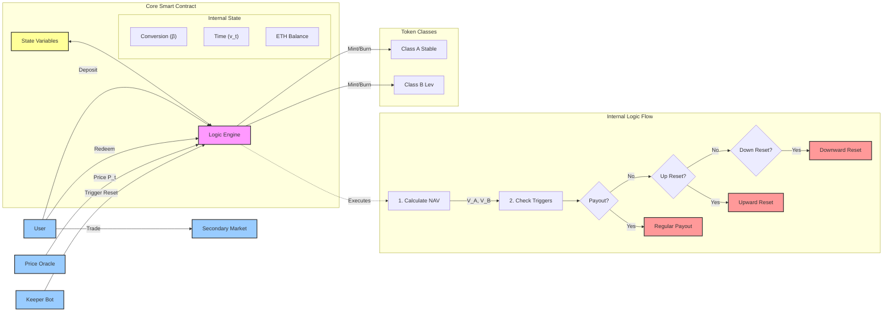

# Detailed Architecture & Logic Diagram

## Key Equations & Parameters

### 1. Leverage Parameter ($\alpha$)

The leverage is determined by the initial split ratio.

- **Formula**: Initial Leverage $= \frac{1}{1 - \alpha}$
- **In this Paper**: $\alpha = 0.5$ (Implies a 50/50 split of capital).
- **Result**: Initial Leverage = 2x. Class B invests \$1 (his own) + \$1 (borrowed from A) = \$2 exposure.

### 2. Beta ($\beta$) Calculation

Beta adjusts the "Quantity of Coins" to keep the "Value per Coin" at $\$1.00$ immediately after a reset.

- **Regular Payout Update**:
  $$ \beta_{new} = \beta_{old} \times \frac{2 P_t}{2 P_t - \beta_{old} P_0 R T} $$
- **Reset Update (Up/Down)**:
  $$ \beta_{new} = \frac{P_t}{P_0} $$

### 3. Net Asset Value (NAV)

Used **only** for triggers (not for trading).

- **Class A**: $V_A(t) = 1 + (R \times v_t)$
- **Class B**: $V_B(t) = \frac{2 P_t}{\beta_t P_0} - V_A(t)$

### 4. Triggers

- **Regular Payout**: $v_t \ge T$
- **Upward Reset**: $V_B \ge H_u$ (e.g., $2.0$)
- **Downward Reset**: $V_B \le H_d$ (e.g., $0.25$)
