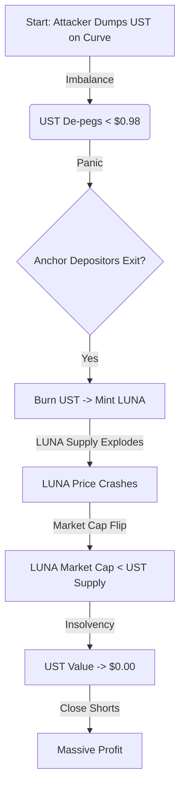

# Stablecoin Research: Analysis, Design, and Modelling

## 1. Analysis

### Objective

Compare 3 of the most relevant Stablecoin protocols: **DAI**, **TerraUSD (UST)**, and **USDT**.

### Comparison Matrix

| Feature | DAI (MakerDAO) | TerraUSD (UST) [Legacy] | USDT (Tether) |
| :--- | :--- | :--- | :--- |
| **Type/Mechanism** | Crypto-Collateralized | Algorithmic (Seigniorage) | Fiat-Collateralized |
| **Key Metric** | Over-collateralized (ETH/RWA) | Backed by LUNA volatility | 1:1 USD & Equivalents |
| **Governance** | Decentralized (MKR) | Decentralized (LUNA Validators) | Centralized (Tether Ltd) |

### Deep Dive

### Deep Dive

#### A. Backing Mechanism

* **DAI (Sky Ecosystem)**: **Hybrid Over-collateralized**.
  * **Core Mechanism**: Users lock >$1 value of assets to mint $1 DAI (now USDS).
  * **Evolution**: Shifted from pure Crypto-Collateralized (ETH) to a **Hybrid Model** including Real World Assets (RWA) and USDC (PSM).
  * **Verification**: Solvency is enforced on-chain via the `Vat` contract invariants (`ink * spot >= art * rate`).
* **UST**: **Algorithmic**. $1 UST could be burned to mint $1 of LUNA. Relied on the market cap of LUNA absorbing volatility. **Failed** due to "death spiral" dynamics.
* **USDT**: **Fiat-backed**. Claims 1:1 backing with cash/equivalents. Capital efficient but relies on trust in Tether's reserves.

#### B. Sustainability

* **DAI**: **The Sustainability Triangle**.
  * Balances three feedback loops: **Collateral Quality**, **Incentive Design** (Fees/Auctions), and **Governance** (Parameter tuning).
  * **Revenue**: Derived from Stability Fees and RWA yields (e.g., T-bills).
  * **Risk**: Requires "Keeper" liquidity during auctions to prevent bad debt accumulation (as seen in Black Thursday 2020).
* **UST**: Relied on **Anchor Protocol** (20% APY) to drive demand. This was **unsustainable** (Ponzi-like structure) as yield was subsidized, not organic.
* **USDT**: Revenue from interest on massive reserve holdings (Treasuries). Highly profitable and sustainable.

#### C. Decentralization

* **DAI**: **Pragmatic Decentralization**.
  * Governance is decentralized (MKR/SKY holders).
  * **Trade-off**: Integration of USDC (via PSM) and RWAs introduces trusted off-chain dependencies to ensure peg stability and scalability.
* **UST**: **High (Theoretically)**. No centralized issuer or collateral. However, wealth concentration in LUNA validators was a risk.
* **USDT**: **Low**. Completely centralized. Tether can freeze funds and blacklist addresses.

---

## 2. Design

### A. Scenario 1: Environment without Liquidation Risk

*Constraint: How would you design an ideal stablecoin in a world where collateral cannot lose value?*

**Proposed Architecture: "Unity" (1:1 On-Chain Wrapper)**

* **Core Mechanism**: Issue stablecoins at a perfect **1:1 ratio** against any deposited asset. Since collateral value is static/up-only, over-collateralization is obsolete.
* **Advantage**: **100% Capital Efficiency**. 1 ETH ($2000) mints 2000 Unity. No liquidations, no auctions.
* **Trade-off**: None in this theoretical world.

### B. Scenario 2: Environment with Highly Risky Collateral

*Constraint: How would you design a stablecoin where all collateral is highly volatile and prone to liquidation?*

**Proposed Architecture: "Duo Network" (Dual-Tranche Structure)**

* **Core Mechanism**: Splits the volatile collateral (e.g., ETH) into two distinct tokens:
    1. **Class A (Stable)**: Absorbs minimal volatility, maintains $1.00 peg.
    2. **Class B (Volatile)**: Absorbs *all* the volatility (leverage). Acts as a buffer for Class A.
* **Mitigation Strategy**: **Coupon/Reset Mechanism**. If Class B value drops too low, the system resets or converts Class A into a coupon to restore the ratio.
* **Trade-off**: **Liquidity Constraints**. Class A stability depends entirely on the demand for Class B (leverage seekers). If no one wants leverage, Class A cannot be minted/maintained efficiently.

---

## 3. Modelling

### Scenario: Terra Luna (UST) De-Peg Event

*Objective: Model the cost of attack vs. potential profit for an attacker triggering the UST/LUNA death spiral.*

#### Assumptions

* **UST Supply ($S$)**: $18,000,000,000 (at peak).
* **Curve Pool Liquidity ($L$)**: ~$300,000,000 (3-pool).
* **Attacker Capital ($C$)**: ~$1,000,000,000 (Accumulated UST + Short positions).

#### The Attack Loop (The Death Spiral)

#### Cost vs. Profit Analysis

$$ \text{Cost} = \text{Slippage on Dump} + \text{Borrow Fees (BTC/LUNA)} \approx \$300M $$

$$ \text{Profit} = (\text{Short LUNA Gains}) + (\text{Short BTC Gains}) \approx \$1B+ $$

**Feasibility Conclusion**:

* **Vulnerability**: The mechanism relied on LUNA market cap > UST supply. When LUNA crashed, the backing evaporated.
* **Attack Viability**: **High**. The liquidity on Curve was thin compared to the massive supply in Anchor. A concentrated dump was sufficient to trigger the panic.
