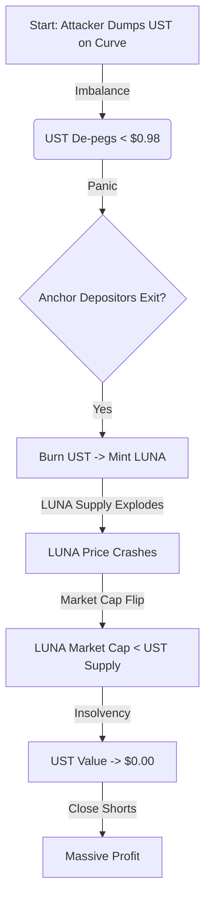

## 3. Modelling

### Scenario: Terra Luna (UST) De-Peg Event

*Objective: Model the cost of attack vs. potential profit for an attacker triggering the UST/LUNA death spiral.*

#### Assumptions

* **UST Supply ($S$)**: $18,000,000,000 (at peak).
* **Curve Pool Liquidity ($L$)**: ~$300,000,000 (3-pool).
* **Attacker Capital ($C$)**: ~$1,000,000,000 (Accumulated UST + Short positions).

#### The Attack Loop (The Death Spiral)

#### Cost vs. Profit Analysis

$$ \text{Cost} = \text{Slippage on Dump} + \text{Borrow Fees (BTC/LUNA)} \approx \$300M $$

$$ \text{Profit} = (\text{Short LUNA Gains}) + (\text{Short BTC Gains}) \approx \$1B+ $$

**Feasibility Conclusion**:

* **Vulnerability**: The mechanism relied on LUNA market cap > UST supply. When LUNA crashed, the backing evaporated.
* **Attack Viability**: **High**. The liquidity on Curve was thin compared to the massive supply in Anchor. A concentrated dump was sufficient to trigger the panic.
